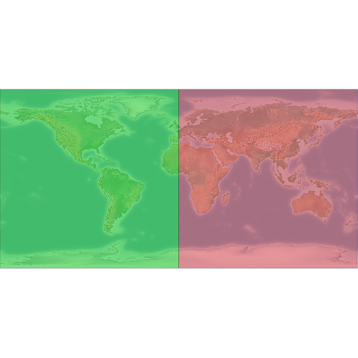

#<center>/[Notebooks](../../)/[Access to Geospatial data](../README.md)/</center>

<b><h1 style="margin: 0.0px 0.0px 0.0px 0.0px; line-height: 15.4px; font: 22.0px 'Lucida Sans'; color: #004d87; -webkit-text-stroke: #004d87; background-color: #ffffff"><span class="s1">GDAL-OGR Quickstart</span></h1></b>

The first Notebook is dedicared to the use of the Geospatial Data Abstraction Library **GDAL** from the bash command line. GDAL is a powerful translator library for raster and vector geospatial data formats it presents a single raster abstract data model and vector abstract data model to the calling application for all supported formats.

This Notebook is derived from the original [GDAL-OGR quickstart](../doc/en/quickstart/gdal_quickstart.html)  adapted to run interactively in a IPython notebook and is composed by two main parts **GDAL** (to handle raster data) and **OGR** (to work with vector data)

<h1 style="margin: 0.0px 0.0px 0.0px 0.0px; line-height: 15.4px; font: 18.0px 'Lucida Sans'; color: #004d87; -webkit-text-stroke: #004d87; background-color: #ffffff"><span class="s1">GDAL</span></h1>

* Explore your image data with [```gdalinfo```](#gdalinfo)
* Format translations, Rescaling, Resizing, Splitting with [```gdal_translate```](#gdal_translate)

    * [```Format translations```](#Format-translation), [```Resizing```](#Resizing), [```Rescaling```](#Rescaling), [```Splitting```](#Splitting)


* Reproject  with [```gdalwarp```](#Reprojecting)
* Raster tileindex with [```gdaltindex```](#gdaltindex)
* Image Mosaic with ```gdal_warp``` or [```gdal_merge.py```](#Mosaicking)

<h1 style="margin: 0.0px 0.0px 0.0px 0.0px; line-height: 15.4px; font: 18.0px 'Lucida Sans'; color: #004d87; -webkit-text-stroke: #004d87; background-color: #ffffff"><span class="s1">OGR </span></h1>
* get information about your data with [```ogrinfo```](#ogrinfo)
* use [```ogr2ogr```](#ogr2ogr) to transform your data to other formats

<b><h1 style="margin: 0.0px 0.0px 0.0px 0.0px; line-height: 15.4px; font: 18.0px 'Lucida Sans'; color: #004d87; -webkit-text-stroke: #004d87; background-color: #ffffff"><span class="s1">Get to know GDAL</span></h1></b> 


You will find the demo data at ```/usr/local/share/data```. We want to have a look at the [naturalearth dataset](../doc/en/overview/naturalearth_overview.html) data in this quickstart. We want to work with a copy of the data. So the first step is to copy the data to your home directory.


    # Import IPython utility to display images
    from IPython.core.display import Image


    cd /home/user

    /home/user


    !rm -rf /home/user/gdal_natural_earth


    !cp -R /usr/local/share/data/natural_earth2/ /home/user/gdal_natural_earth

You will then find a series of geotiff file:


    ls /home/user/gdal_natural_earth/HYP_50M_SR_W.*

    /home/user/gdal_natural_earth/HYP_50M_SR_W.prj
    /home/user/gdal_natural_earth/HYP_50M_SR_W.README.html
    /home/user/gdal_natural_earth/HYP_50M_SR_W.tfw
    /home/user/gdal_natural_earth/HYP_50M_SR_W.tif
    /home/user/gdal_natural_earth/HYP_50M_SR_W.VERSION.txt


##<b><h1 style="margin: 0.0px 0.0px 0.0px 0.0px; line-height: 15.4px; font: 18.0px 'Lucida Sans'; color: #004d87; -webkit-text-stroke: #004d87; background-color: #ffffff"><span class="s1">gdalinfo</span></h1></b> 

<b><h2 style="margin: 0.0px 0.0px 0.0px 0.0px; line-height: 15.4px; font: 16.0px 'Lucida Sans'; color: #004d87; -webkit-text-stroke: #004d87; background-color: #ffffff"><span class="s1">get information about the raster data</span></h2></b> 


    !gdalinfo /home/user/gdal_natural_earth/HYP_50M_SR_W.tif

    Driver: GTiff/GeoTIFF
    Files: /home/user/gdal_natural_earth/HYP_50M_SR_W.tif
           /home/user/gdal_natural_earth/HYP_50M_SR_W.tfw
    Size is 10800, 5400
    Coordinate System is:
    GEOGCS["WGS 84",
        DATUM["WGS_1984",
            SPHEROID["WGS 84",6378137,298.257223563,
                AUTHORITY["EPSG","7030"]],
            AUTHORITY["EPSG","6326"]],
        PRIMEM["Greenwich",0],
        UNIT["degree",0.0174532925199433],
        AUTHORITY["EPSG","4326"]]
    Origin = (-179.999999999999972,90.000000000000000)
    Pixel Size = (0.033333333333330,-0.033333333333330)
    Metadata:
      AREA_OR_POINT=Area
      TIFFTAG_DATETIME=2012:07:16 09:16:14
      TIFFTAG_RESOLUTIONUNIT=2 (pixels/inch)
      TIFFTAG_SOFTWARE=Adobe Photoshop CS5 Macintosh
      TIFFTAG_XRESOLUTION=342.85699
      TIFFTAG_YRESOLUTION=342.85699
    Image Structure Metadata:
      COMPRESSION=YCbCr JPEG
      INTERLEAVE=PIXEL
      SOURCE_COLOR_SPACE=YCbCr
    Corner Coordinates:
    Upper Left  (-180.0000000,  90.0000000) (180d 0' 0.00"W, 90d 0' 0.00"N)
    Lower Left  (-180.0000000, -90.0000000) (180d 0' 0.00"W, 90d 0' 0.00"S)
    Upper Right ( 180.0000000,  90.0000000) (180d 0' 0.00"E, 90d 0' 0.00"N)
    Lower Right ( 180.0000000, -90.0000000) (180d 0' 0.00"E, 90d 0' 0.00"S)
    Center      (  -0.0000000,   0.0000000) (  0d 0' 0.00"W,  0d 0' 0.00"N)
    Band 1 Block=256x256 Type=Byte, ColorInterp=Red
    Band 2 Block=256x256 Type=Byte, ColorInterp=Green
    Band 3 Block=256x256 Type=Byte, ColorInterp=Blue


---

Note:
* Driver is “GTiff/GeoTIFF”
* Size is 10800x5400
* 3 Bands of type Byte.
* Coordinates
* Coordinate system is World Geodetic System 84

<b><h1 style="margin: 0.0px 0.0px 0.0px 0.0px; line-height: 15.4px; font: 16.0px 'Lucida Sans'; color: #004d87; -webkit-text-stroke: #004d87; background-color: #ffffff"><span class="s1">Listing available Drivers</span></h1></b> 

First get to know your drivers. The ```--formats``` commandline switch of gdalinfo can be used to see a list of available format drivers.

List all the available formats:


    !gdalinfo --formats

    Supported Formats:
      VRT (rw+v): Virtual Raster
      GTiff (rw+vs): GeoTIFF
      NITF (rw+vs): National Imagery Transmission Format
      RPFTOC (rovs): Raster Product Format TOC format
      ECRGTOC (rovs): ECRG TOC format
      HFA (rw+v): Erdas Imagine Images (.img)
      SAR_CEOS (rov): CEOS SAR Image
      CEOS (rov): CEOS Image
      JAXAPALSAR (rov): JAXA PALSAR Product Reader (Level 1.1/1.5)
      GFF (rov): Ground-based SAR Applications Testbed File Format (.gff)
      ELAS (rw+v): ELAS
      AIG (rov): Arc/Info Binary Grid
      AAIGrid (rwv): Arc/Info ASCII Grid
      GRASSASCIIGrid (rov): GRASS ASCII Grid
      SDTS (rov): SDTS Raster
      OGDI (ros): OGDI Bridge
      DTED (rwv): DTED Elevation Raster
      PNG (rwv): Portable Network Graphics
      JPEG (rwv): JPEG JFIF
      MEM (rw+): In Memory Raster
      JDEM (rov): Japanese DEM (.mem)
      GIF (rwv): Graphics Interchange Format (.gif)
      BIGGIF (rov): Graphics Interchange Format (.gif)
      ESAT (rov): Envisat Image Format
      BSB (rov): Maptech BSB Nautical Charts
      XPM (rwv): X11 PixMap Format
      BMP (rw+v): MS Windows Device Independent Bitmap
      DIMAP (rov): SPOT DIMAP
      AirSAR (ro): AirSAR Polarimetric Image
      RS2 (ros): RadarSat 2 XML Product
      PCIDSK (rw+v): PCIDSK Database File
      PCRaster (rw): PCRaster Raster File
      ILWIS (rw+v): ILWIS Raster Map
      SGI (rw+): SGI Image File Format 1.0
      SRTMHGT (rwv): SRTMHGT File Format
      Leveller (rw+): Leveller heightfield
      Terragen (rw+): Terragen heightfield
      GMT (rw): GMT NetCDF Grid Format
      netCDF (rw+s): Network Common Data Format
      HDF4 (ros): Hierarchical Data Format Release 4
      HDF4Image (rw+): HDF4 Dataset
      ISIS3 (rov): USGS Astrogeology ISIS cube (Version 3)
      ISIS2 (rw+v): USGS Astrogeology ISIS cube (Version 2)
      PDS (rov): NASA Planetary Data System
      TIL (rov): EarthWatch .TIL
      ERS (rw+v): ERMapper .ers Labelled
      L1B (rovs): NOAA Polar Orbiter Level 1b Data Set
      FIT (rwv): FIT Image
      GRIB (rov): GRIdded Binary (.grb)
      JPEG2000 (rwv): JPEG-2000 part 1 (ISO/IEC 15444-1)
      RMF (rw+v): Raster Matrix Format
      WCS (rovs): OGC Web Coverage Service
      WMS (rwvs): OGC Web Map Service
      MSGN (ro): EUMETSAT Archive native (.nat)
      RST (rw+v): Idrisi Raster A.1
      INGR (rw+v): Intergraph Raster
      GSAG (rwv): Golden Software ASCII Grid (.grd)
      GSBG (rw+v): Golden Software Binary Grid (.grd)
      GS7BG (rw+v): Golden Software 7 Binary Grid (.grd)
      COSAR (ro): COSAR Annotated Binary Matrix (TerraSAR-X)
      TSX (rov): TerraSAR-X Product
      COASP (ro): DRDC COASP SAR Processor Raster
      R (rwv): R Object Data Store
      MAP (rov): OziExplorer .MAP
      PNM (rw+v): Portable Pixmap Format (netpbm)
      DOQ1 (rov): USGS DOQ (Old Style)
      DOQ2 (rov): USGS DOQ (New Style)
      ENVI (rw+v): ENVI .hdr Labelled
      EHdr (rw+v): ESRI .hdr Labelled
      GenBin (rov): Generic Binary (.hdr Labelled)
      PAux (rw+): PCI .aux Labelled
      MFF (rw+): Vexcel MFF Raster
      MFF2 (rw+): Vexcel MFF2 (HKV) Raster
      FujiBAS (ro): Fuji BAS Scanner Image
      GSC (rov): GSC Geogrid
      FAST (rov): EOSAT FAST Format
      BT (rw+v): VTP .bt (Binary Terrain) 1.3 Format
      LAN (rw+v): Erdas .LAN/.GIS
      CPG (ro): Convair PolGASP
      IDA (rw+): Image Data and Analysis
      NDF (rov): NLAPS Data Format
      EIR (rov): Erdas Imagine Raw
      DIPEx (rov): DIPEx
      LCP (rwv): FARSITE v.4 Landscape File (.lcp)
      GTX (rw+v): NOAA Vertical Datum .GTX
      LOSLAS (rov): NADCON .los/.las Datum Grid Shift
      NTv2 (rw+vs): NTv2 Datum Grid Shift
      CTable2 (rw+v): CTable2 Datum Grid Shift
      ACE2 (rov): ACE2
      SNODAS (rov): Snow Data Assimilation System
      KRO (rw+v): KOLOR Raw
      ARG (rwv): Azavea Raster Grid format
      RIK (ro): Swedish Grid RIK (.rik)
      USGSDEM (rwv): USGS Optional ASCII DEM (and CDED)
      GXF (ro): GeoSoft Grid Exchange Format
      DODS (ro): DAP 3.x servers
      HTTP (ro): HTTP Fetching Wrapper
      BAG (ro): Bathymetry Attributed Grid
      HDF5 (ros): Hierarchical Data Format Release 5
      HDF5Image (ro): HDF5 Dataset
      NWT_GRD (rov): Northwood Numeric Grid Format .grd/.tab
      NWT_GRC (rov): Northwood Classified Grid Format .grc/.tab
      ADRG (rw+vs): ARC Digitized Raster Graphics
      SRP (rovs): Standard Raster Product (ASRP/USRP)
      BLX (rw): Magellan topo (.blx)
      Rasterlite (rws): Rasterlite
      EPSILON (rwv): Epsilon wavelets
      PostGISRaster (rws): PostGIS Raster driver
      SAGA (rw+v): SAGA GIS Binary Grid (.sdat)
      KMLSUPEROVERLAY (rwv): Kml Super Overlay
      XYZ (rwv): ASCII Gridded XYZ
      HF2 (rwv): HF2/HFZ heightfield raster
      PDF (rwvs): Geospatial PDF
      OZI (rov): OziExplorer Image File
      CTG (rov): USGS LULC Composite Theme Grid
      E00GRID (rov): Arc/Info Export E00 GRID
      WEBP (rwv): WEBP
      ZMap (rwv): ZMap Plus Grid
      NGSGEOID (rov): NOAA NGS Geoid Height Grids
      MBTiles (rov): MBTiles
      IRIS (rov): IRIS data (.PPI, .CAPPi etc)


Each format reports if it is:
* read only (ro),
* read/write (rw) or
* read/write/update (rw+).

It is also possible to ask for specific formats details:


    !gdalinfo --format GTiff 

    Format Details:
      Short Name: GTiff
      Long Name: GeoTIFF
      Extension: tif
      Mime Type: image/tiff
      Help Topic: frmt_gtiff.html
      Supports: Subdatasets
      Supports: Create() - Create writeable dataset.
      Supports: CreateCopy() - Create dataset by copying another.
      Supports: Virtual IO - eg. /vsimem/
      Creation Datatypes: Byte UInt16 Int16 UInt32 Int32 Float32 Float64 CInt16 CInt32 CFloat32 CFloat64
    
    <CreationOptionList>
      <Option name="COMPRESS" type="string-select">
        <Value>NONE</Value>
        <Value>LZW</Value>
        <Value>PACKBITS</Value>
        <Value>JPEG</Value>
        <Value>CCITTRLE</Value>
        <Value>CCITTFAX3</Value>
        <Value>CCITTFAX4</Value>
        <Value>DEFLATE</Value>
        <Value>LZMA</Value>
      </Option>
      <Option name="PREDICTOR" type="int" description="Predictor Type" />
      <Option name="JPEG_QUALITY" type="int" description="JPEG quality 1-100" default="75" />
      <Option name="ZLEVEL" type="int" description="DEFLATE compression level 1-9" default="6" />
      <Option name="LZMA_PRESET" type="int" description="LZMA compression level 0(fast)-9(slow)" default="6" />
      <Option name="NBITS" type="int" description="BITS for sub-byte files (1-7), sub-uint16 (9-15), sub-uint32 (17-31)" />
      <Option name="INTERLEAVE" type="string-select" default="PIXEL">
        <Value>BAND</Value>
        <Value>PIXEL</Value>
      </Option>
      <Option name="TILED" type="boolean" description="Switch to tiled format" />
      <Option name="TFW" type="boolean" description="Write out world file" />
      <Option name="RPB" type="boolean" description="Write out .RPB (RPC) file" />
      <Option name="BLOCKXSIZE" type="int" description="Tile Width" />
      <Option name="BLOCKYSIZE" type="int" description="Tile/Strip Height" />
      <Option name="PHOTOMETRIC" type="string-select">
        <Value>MINISBLACK</Value>
        <Value>MINISWHITE</Value>
        <Value>PALETTE</Value>
        <Value>RGB</Value>
        <Value>CMYK</Value>
        <Value>YCBCR</Value>
        <Value>CIELAB</Value>
        <Value>ICCLAB</Value>
        <Value>ITULAB</Value>
      </Option>
      <Option name="SPARSE_OK" type="boolean" description="Can newly created files have missing blocks?" default="FALSE" />
      <Option name="ALPHA" type="string-select" description="Mark first extrasample as being alpha">
        <Value>NON-PREMULTIPLIED</Value>
        <Value>PREMULTIPLIED</Value>
        <Value>UNSPECIFIED</Value>
        <Value aliasOf="NON-PREMULTIPLIED">YES</Value>
        <Value aliasOf="UNSPECIFIED">NO</Value>
      </Option>
      <Option name="PROFILE" type="string-select" default="GDALGeoTIFF">
        <Value>GDALGeoTIFF</Value>
        <Value>GeoTIFF</Value>
        <Value>BASELINE</Value>
      </Option>
      <Option name="PIXELTYPE" type="string-select">
        <Value>DEFAULT</Value>
        <Value>SIGNEDBYTE</Value>
      </Option>
      <Option name="BIGTIFF" type="string-select" description="Force creation of BigTIFF file">
        <Value>YES</Value>
        <Value>NO</Value>
        <Value>IF_NEEDED</Value>
        <Value>IF_SAFER</Value>
      </Option>
      <Option name="ENDIANNESS" type="string-select" default="NATIVE" description="Force endianness of created file. For DEBUG purpose mostly">
        <Value>NATIVE</Value>
        <Value>INVERTED</Value>
        <Value>LITTLE</Value>
        <Value>BIG</Value>
      </Option>
      <Option name="COPY_SRC_OVERVIEWS" type="boolean" default="NO" description="Force copy of overviews of source dataset (CreateCopy())" />
      <Option name="SOURCE_ICC_PROFILE" type="string" description="ICC profile" />
      <Option name="SOURCE_PRIMARIES_RED" type="string" description="x,y,1.0 (xyY) red chromaticity" />
      <Option name="SOURCE_PRIMARIES_GREEN" type="string" description="x,y,1.0 (xyY) green chromaticity" />
      <Option name="SOURCE_PRIMARIES_BLUE" type="string" description="x,y,1.0 (xyY) blue chromaticity" />
      <Option name="SOURCE_WHITEPOINT" type="string" description="x,y,1.0 (xyY) whitepoint" />
      <Option name="TIFFTAG_TRANSFERFUNCTION_RED" type="string" description="Transfer function for red" />
      <Option name="TIFFTAG_TRANSFERFUNCTION_GREEN" type="string" description="Transfer function for green" />
      <Option name="TIFFTAG_TRANSFERFUNCTION_BLUE" type="string" description="Transfer function for blue" />
      <Option name="TIFFTAG_TRANSFERRANGE_BLACK" type="string" description="Transfer range for black" />
      <Option name="TIFFTAG_TRANSFERRANGE_WHITE" type="string" description="Transfer range for white" />
    </CreationOptionList>
    


<b><h1 style="margin: 0.0px 0.0px 0.0px 0.0px; line-height: 15.4px; font: 18.0px 'Lucida Sans'; color: #004d87; -webkit-text-stroke: #004d87; background-color: #ffffff"><span class="s1">gdal_translate</span></h1></b> 

<b><h1 style="margin: 0.0px 0.0px 0.0px 0.0px; line-height: 15.4px; font: 16.0px 'Lucida Sans'; color: #004d87; -webkit-text-stroke: #004d87; background-color: #ffffff"><span class="s1">Format translation</span></h1></b> 

Translations are accomplished with the gdal_translate command. The default output format is GeoTIFF. The ```-of``` flag is used to select an output format and the ```-co``` flag is used to specify a creation option:

The web browser is not happy with tif files so to have a quick look at the image we convert it to a web friendly format (JPG) using ```gdal_translate``` (this requires few seconds)


    !gdal_translate -of JPEG -co QUALITY=10 /home/user/gdal_natural_earth/HYP_50M_SR_W.tif /home/user/gdal_natural_earth/HYP_50M_SR_W.jpg

    Input file size is 10800, 5400
    0...10...20...30...40...50...60...70...80...90...100 - done.


<b><h1 style="margin: 0.0px 0.0px 0.0px 0.0px; line-height: 15.4px; font: 16.0px 'Lucida Sans'; color: #004d87; -webkit-text-stroke: #004d87; background-color: #ffffff"><span class="s1">Image Display</span></h1></b> 


    Image('/home/user/gdal_natural_earth/HYP_50M_SR_W.jpg')


The -ot switch can be used to alter the output data type.


    !gdal_translate -ot Int16 /home/user/gdal_natural_earth/HYP_50M_SR_W.tif /home/user/gdal_natural_earth/HYP_50M_SR_W_Int16.tif

    Input file size is 10800, 5400
    0...10...20...30...40...50...60...70...80...90...100 - done.


Use gdalinfo to verify data type.


    !gdalinfo /home/user/gdal_natural_earth/HYP_50M_SR_W.tif | grep Band

    Band 1 Block=256x256 Type=Byte, ColorInterp=Red
    Band 2 Block=256x256 Type=Byte, ColorInterp=Green
    Band 3 Block=256x256 Type=Byte, ColorInterp=Blue


    !gdalinfo /home/user/gdal_natural_earth/HYP_50M_SR_W_Int16.tif | grep Band

    Band 1 Block=10800x1 Type=Int16, ColorInterp=Red
    Band 2 Block=10800x1 Type=Int16, ColorInterp=Green
    Band 3 Block=10800x1 Type=Int16, ColorInterp=Blue


<b><h1 style="margin: 0.0px 0.0px 0.0px 0.0px; line-height: 15.4px; font: 16.0px 'Lucida Sans'; color: #004d87; -webkit-text-stroke: #004d87; background-color: #ffffff"><span class="s1">Resizing</span></h1></b>  

The -outsize switch can be used to set the size of the output file.


    !gdal_translate -outsize 50% 50% /home/user/gdal_natural_earth/HYP_50M_SR_W.tif  /home/user/gdal_natural_earth/HYP_50M_SR_W_small.tif

    Input file size is 10800, 5400
    0...10...20...30...40...50...60...70...80...90...100 - done.


Use gdalinfo to verify the size.


    !gdalinfo /home/user/gdal_natural_earth/HYP_50M_SR_W.tif | grep Size

    Size is 10800, 5400
    Pixel Size = (0.033333333333330,-0.033333333333330)


    !gdalinfo /home/user/gdal_natural_earth/HYP_50M_SR_W_small.tif | grep Size

    Size is 5400, 2700
    Pixel Size = (0.066666666666660,-0.066666666666660)


<b><h1 style="margin: 0.0px 0.0px 0.0px 0.0px; line-height: 15.4px; font: 16.0px 'Lucida Sans'; color: #004d87; -webkit-text-stroke: #004d87; background-color: #ffffff"><span class="s1">Rescaling</span></h1></b>  

The -scale switch can be used to rescale the data range of a given image. Explicit control of the input and output ranges is also available. The gdalinfo ```-mm``` switch can be used to see pixel min/max values.

The output will display a computed Min/Max value for each band in the raster imput (3 band in our case)


    !gdalinfo -mm /home/user/gdal_natural_earth/HYP_50M_SR_W_small.tif | grep Min/Max

        Computed Min/Max=62.000,255.000
        Computed Min/Max=85.000,255.000
        Computed Min/Max=79.000,255.000


To rescale a specific band we can use the "-scale_bn" syntax where bn is a band number (e.g. "-scale_2" for the 2nd band of the output dataset), in the example below we will rescale the 3 bands of the HYP_50M_SR_W GeoTiff to be in the range 0-255 :


    !gdal_translate -scale_1 62.000 255.000 0 255.000 \
                   -scale_2 85.000 255.000 0 255.000 \
                   -scale_3 79.000 255.000 0 255.000 \
                   /home/user/gdal_natural_earth/HYP_50M_SR_W.tif /home/user/gdal_natural_earth/HYP_50M_SR_W_scaled.tif

    Input file size is 10800, 5400
    0...10...20...30...40...50...60...70...80...90...100 - done.


Check the results with ```gdalinfo``` :


    !gdalinfo -mm /home/user/gdal_natural_earth/HYP_50M_SR_W_scaled.tif | grep Min/Max

        Computed Min/Max=0.000,255.000
        Computed Min/Max=0.000,255.000
        Computed Min/Max=0.000,255.000


Let's convert the scaled output to JPG for a quick display, notice the color rearrangement.


    !gdal_translate -of JPEG -co QUALITY=40 /home/user/gdal_natural_earth/HYP_50M_SR_W_scaled.tif /home/user/gdal_natural_earth/HYP_50M_SR_W_scaled.jpg

    Input file size is 10800, 5400
    0...10...20...30...40...50...60...70...80...90...100 - done.


    Image('/home/user/gdal_natural_earth/HYP_50M_SR_W_scaled.jpg')


compare with [original image](#Image-Display)

<b><h1 style="margin: 0.0px 0.0px 0.0px 0.0px; line-height: 15.4px; font: 16.0px 'Lucida Sans'; color: #004d87; -webkit-text-stroke: #004d87; background-color: #ffffff"><span class="s1">Splitting</span></h1></b> 

Let’s split our image into two with ```-srcwin``` which makes a copy based on pixel/line location (xoff yoff xsize ysize). You also could use ```-projwin``` and define the corners in georeferenced coordinates (ulx uly lrx lry).


    !gdal_translate -srcwin 0 0 5400 5400 /home/user/gdal_natural_earth/HYP_50M_SR_W.tif  /home/user/gdal_natural_earth/west.tif
    !gdal_translate -srcwin 5400 0 5400 5400 /home/user/gdal_natural_earth/HYP_50M_SR_W.tif  /home/user/gdal_natural_earth/east.tif

    Input file size is 10800, 5400
    0...10...20...30...40...50...60...70...80...90...100 - done.
    Input file size is 10800, 5400
    0...10...20...30...40...50...60...70...80...90...100 - done.


    !gdal_translate -of JPEG -co QUALITY=40 /home/user/gdal_natural_earth/east.tif /home/user/gdal_natural_earth/east.jpg
    !gdal_translate -of JPEG -co QUALITY=40 /home/user/gdal_natural_earth/west.tif /home/user/gdal_natural_earth/west.jpg

    Input file size is 5400, 5400
    0...10...20...30...40...50...60...70...80...90...100 - done.
    Input file size is 5400, 5400
    0...10...20...30...40...50...60...70...80...90...100 - done.


<b><h1 style="margin: 0.0px 0.0px 0.0px 0.0px; line-height: 15.4px; font: 18.0px 'Lucida Sans'; color: #004d87; -webkit-text-stroke: #004d87; background-color: #ffffff"><span class="s1">gdalwarp</span></h1></b>  


<b><h1 style="margin: 0.0px 0.0px 0.0px 0.0px; line-height: 15.4px; font: 16.0px 'Lucida Sans'; color: #004d87; -webkit-text-stroke: #004d87; background-color: #ffffff"><span class="s1">Reprojecting</span></h1></b>  


For this process we assume that HYP_50M_SR_W.tif has been properly created with bounds. As we saw before with gdalinfo HYP_50M_SR_W has a proper coordinate system set. 

If the tif file we want work on doesn't have proper projection information (wich is the case in most *.tif* files when associated with a world file *.tfw*) it is possible to assign a coordinate system to the image with ```gdal_translate``` and the flag ```-a_srs``` e.g :

    gdal_translate -a_srs WGS84 HYP_50M_SR_W.tif HYP_50M_SR_W_4326.tif
    
    
Given a proper georeferenced raster file the ```gdalwarp``` command can be used to assign a new Spatial Reference System to it. Here we reproject the WGS84 geographic image to the Mercator projection:


    !gdalwarp -t_srs '+proj=merc +datum=WGS84' /home/user/gdal_natural_earth/HYP_50M_SR_W.tif /home/user/gdal_natural_earth/mercator.tif

    Creating output file that is 7292P x 9625L.
    Processing input file /home/user/gdal_natural_earth/HYP_50M_SR_W.tif.
    0...10...20...30...40...50...60...70...80...90...100 - done.


    !gdal_translate -of JPEG -co QUALITY=40 /home/user/gdal_natural_earth/mercator.tif /home/user/gdal_natural_earth/mercator.png

    Input file size is 7292, 9625
    0...10...20...30...40...50...60...70...80...90...100 - done.


    Image('/home/user/gdal_natural_earth/mercator.png')


Here we reproject to the Ortho projection.


    !gdalwarp -t_srs '+proj=ortho +datum=WGS84' /home/user/gdal_natural_earth/HYP_50M_SR_W.tif /home/user/gdal_natural_earth/ortho.tif

    ERROR 1: tolerance condition error
    ERROR 1: tolerance condition error
    ...
    ...
    ERROR 1: tolerance condition error
    ERROR 1: tolerance condition error
    ERROR 1: Reprojection failed, err = -20, further errors will be suppressed on the transform object.
    Creating output file that is 8538P x 8538L.
    Processing input file /home/user/gdal_natural_earth/HYP_50M_SR_W.tif.
    0...10...20...30...40...50...60...70...80...90...100 - done.


    !gdal_translate -of JPEG -co QUALITY=40 /home/user/gdal_natural_earth/ortho.tif /home/user/gdal_natural_earth/ortho.png

    Input file size is 8538, 8538
    0...10...20...30...40...50...60...70...80...90...100 - done.


    Image('/home/user/gdal_natural_earth/ortho.png')


<b><h1 style="margin: 0.0px 0.0px 0.0px 0.0px; line-height: 15.4px; font: 18.0px 'Lucida Sans'; color: #004d87; -webkit-text-stroke: #004d87; background-color: #ffffff"><span class="s1">gdaltindex</span></h1></b>  


<b><h1 style="margin: 0.0px 0.0px 0.0px 0.0px; line-height: 15.4px; font: 16.0px 'Lucida Sans'; color: #004d87; -webkit-text-stroke: #004d87; background-color: #ffffff"><span class="s1">Raster tileindex with gdaltindex</span></h1></b> 
You can build a shapefile as a raster tileindex. For every image a polygon is generated with the bounds of the extent of the polygon and the path to the file.


    !gdaltindex /home/user/gdal_natural_earth/index_natural_earth.shp /home/user/gdal_natural_earth/*st.tif

    Creating new index file...


The command above just created a new ESRI Shape File (default vector format), we will see how to work on vector files later on in the **OGR** section.

<b><h1 style="margin: 0.0px 0.0px 0.0px 0.0px; line-height: 15.4px; font: 18.0px 'Lucida Sans'; color: #004d87; -webkit-text-stroke: #004d87; background-color: #ffffff"><span class="s1">Mosaicking</span></h1></b>   

```gdal_merge.py``` is a python script that can be used for simple mosaicking tasks. Mosaic the east.tif and west.tif into a single file:


    !gdal_merge.py  /home/user/gdal_natural_earth/east.tif /home/user/gdal_natural_earth/west.tif -o /home/user/gdal_natural_earth/merged.tif

    0...10...20...30...40...50...60...70...80...90...100 - done.


Convert to jpg to display in the notebook and you can see the original image recomposed


    !gdal_translate -of JPEG -co QUALITY=40 /home/user/gdal_natural_earth/merged.tif /home/user/gdal_natural_earth/merged.jpg

    Input file size is 10800, 5400
    0...10...20...30...40...50...60...70...80...90...100 - done.


    Image('/home/user/gdal_natural_earth/merged.jpg')


The same task can be accomplished with gdalwarp. gdalwarp has a variety of advantages over gdal_merge, but can be slow to merge many files:

    gdalwarp east.tif west.tif warpmerged.tif

<b><h1 style="margin: 0.0px 0.0px 0.0px 0.0px; line-height: 15.4px; font: 18.0px 'Lucida Sans'; color: #004d87; -webkit-text-stroke: #004d87; background-color: #ffffff"><span class="s1">Get to know OGR</span></h1></b>  


<b><h1 style="margin: 0.0px 0.0px 0.0px 0.0px; line-height: 15.4px; font: 16.0px 'Lucida Sans'; color: #004d87; -webkit-text-stroke: #004d87; background-color: #ffffff"><span class="s1">ogrinfo</span></h1></b>  

Like we did with raster using ```gdalinfo```, is possible to retrieve descriptive information from a vector datasource using the command line too ```ogrinfo```.
Let's run ```ogrinfo``` on the previously generated shapefile ```index_natural_earth.shp```:


    !ogrinfo /home/user/gdal_natural_earth/index_natural_earth.shp index_natural_earth

    INFO: Open of `/home/user/gdal_natural_earth/index_natural_earth.shp'
          using driver `ESRI Shapefile' successful.
    
    Layer name: index_natural_earth
    Geometry: Polygon
    Feature Count: 2
    Extent: (-180.000000, -90.000000) - (180.000000, 90.000000)
    Layer SRS WKT:
    GEOGCS["GCS_WGS_1984",
        DATUM["WGS_1984",
            SPHEROID["WGS_84",6378137,298.257223563]],
        PRIMEM["Greenwich",0],
        UNIT["Degree",0.017453292519943295]]
    location: String (254.0)
    OGRFeature(index_natural_earth):0
      location (String) = /home/user/gdal_natural_earth/east.tif
      POLYGON ((-0.000000000017963 90.0,179.999999999964047 90.0,179.999999999964047 -89.999999999982009,-0.000000000017963 -89.999999999982009,-0.000000000017963 90.0))
    
    OGRFeature(index_natural_earth):1
      location (String) = /home/user/gdal_natural_earth/west.tif
      POLYGON ((-180.0 90.0,-0.000000000017963 90.0,-0.000000000017963 -89.999999999982009,-180.0 -89.999999999982009,-180.0 90.0))
    


Get a summary about your data with ogrinfo together with -so.


    !ogrinfo -ro -so /home/user/gdal_natural_earth/ne_10m_admin_0_countries.shp ne_10m_admin_0_countries

    INFO: Open of `/home/user/gdal_natural_earth/ne_10m_admin_0_countries.shp'
          using driver `ESRI Shapefile' successful.
    
    Layer name: ne_10m_admin_0_countries
    Geometry: Polygon
    Feature Count: 254
    Extent: (-180.000000, -90.000000) - (180.000000, 83.634101)
    Layer SRS WKT:
    GEOGCS["GCS_WGS_1984",
        DATUM["WGS_1984",
            SPHEROID["WGS_84",6378137.0,298.257223563]],
        PRIMEM["Greenwich",0.0],
        UNIT["Degree",0.0174532925199433]]
    scalerank: Integer (4.0)
    featurecla: String (30.0)
    labelrank: Real (16.6)
    sovereignt: String (254.0)
    sov_a3: String (254.0)
    adm0_dif: Real (16.6)
    level: Real (16.6)
    type: String (254.0)
    admin: String (254.0)
    adm0_a3: String (254.0)
    geou_dif: Real (16.6)
    geounit: String (254.0)
    gu_a3: String (254.0)
    su_dif: Real (16.6)
    subunit: String (254.0)
    su_a3: String (254.0)
    brk_diff: Real (16.6)
    name: String (254.0)
    name_long: String (254.0)
    brk_a3: String (254.0)
    brk_name: String (254.0)
    brk_group: String (254.0)
    abbrev: String (254.0)
    postal: String (254.0)
    formal_en: String (254.0)
    formal_fr: String (254.0)
    note_adm0: String (254.0)
    note_brk: String (254.0)
    name_sort: String (254.0)
    name_alt: String (254.0)
    mapcolor7: Real (16.6)
    mapcolor8: Real (16.6)
    mapcolor9: Real (16.6)
    mapcolor13: Real (16.6)
    pop_est: Real (16.6)
    gdp_md_est: Real (16.6)
    pop_year: Real (16.6)
    lastcensus: Real (16.6)
    gdp_year: Real (16.6)
    economy: String (254.0)
    income_grp: String (254.0)
    wikipedia: Real (16.6)
    fips_10: String (254.0)
    iso_a2: String (254.0)
    iso_a3: String (254.0)
    iso_n3: String (254.0)
    un_a3: String (254.0)
    wb_a2: String (254.0)
    wb_a3: String (254.0)
    woe_id: Real (16.6)
    adm0_a3_is: String (254.0)
    adm0_a3_us: String (254.0)
    adm0_a3_un: Real (16.6)
    adm0_a3_wb: Real (16.6)
    continent: String (254.0)
    region_un: String (254.0)
    subregion: String (254.0)
    region_wb: String (254.0)
    name_len: Real (16.6)
    long_len: Real (16.6)
    abbrev_len: Real (16.6)
    tiny: Real (16.6)
    homepart: Real (16.6)


If you run ogrinfo without a parameter you will get a summary about your data and afterwards a section for every dataset. You can forward the result from ogrinfo to grep to filter and get only the attribute COUNTRY.


    !ogrinfo -ro /home/user/gdal_natural_earth/ne_10m_admin_0_countries.shp ne_10m_admin_0_countries | grep 'admin '

      admin (String) = Aruba
      admin (String) = Afghanistan
      admin (String) = Angola
      admin (String) = Anguilla
      admin (String) = Albania
      admin (String) = Aland
      admin (String) = Andorra
      admin (String) = United Arab Emirates
      admin (String) = Argentina
      admin (String) = Armenia
      admin (String) = American Samoa
      admin (String) = Antarctica
      admin (String) = French Southern and Antarctic Lands
      admin (String) = Antigua and Barbuda
      admin (String) = Australia
      admin (String) = Austria
      admin (String) = Azerbaijan
      admin (String) = Burundi
      admin (String) = Belgium
      admin (String) = Benin
      admin (String) = Burkina Faso
      admin (String) = Bangladesh
      admin (String) = Bulgaria
      admin (String) = Bahrain
      admin (String) = The Bahamas
      admin (String) = Bosnia and Herzegovina
      admin (String) = Bajo Nuevo Bank (Petrel Is.)
      admin (String) = Saint Barthelemy
      admin (String) = Belarus
      admin (String) = Belize
      admin (String) = Bermuda
      admin (String) = Bolivia
      admin (String) = Brazil
      admin (String) = Barbados
      admin (String) = Brunei
      admin (String) = Bhutan
      admin (String) = Botswana
      admin (String) = Central African Republic
      admin (String) = Canada
      admin (String) = Switzerland
      admin (String) = Chile
      admin (String) = China
      admin (String) = Ivory Coast
      admin (String) = Clipperton Island
      admin (String) = Cameroon
      admin (String) = Cyprus No Mans Area
      admin (String) = Democratic Republic of the Congo
      admin (String) = Republic of Congo
      admin (String) = Cook Islands
      admin (String) = Colombia
      admin (String) = Comoros
      admin (String) = Cape Verde
      admin (String) = Costa Rica
      admin (String) = Coral Sea Islands
      admin (String) = Cuba
      admin (String) = Curaçao
      admin (String) = Cayman Islands
      admin (String) = Northern Cyprus
      admin (String) = Cyprus
      admin (String) = Czech Republic
      admin (String) = Germany
      admin (String) = Djibouti
      admin (String) = Dominica
      admin (String) = Denmark
      admin (String) = Dominican Republic
      admin (String) = Algeria
      admin (String) = Ecuador
      admin (String) = Egypt
      admin (String) = Eritrea
      admin (String) = Dhekelia Sovereign Base Area
      admin (String) = Spain
      admin (String) = Estonia
      admin (String) = Ethiopia
      admin (String) = Finland
      admin (String) = Fiji
      admin (String) = Falkland Islands
      admin (String) = France
      admin (String) = Faroe Islands
      admin (String) = Federated States of Micronesia
      admin (String) = Gabon
      admin (String) = United Kingdom
      admin (String) = Georgia
      admin (String) = Guernsey
      admin (String) = Ghana
      admin (String) = Gibraltar
      admin (String) = Guinea
      admin (String) = Gambia
      admin (String) = Guinea Bissau
      admin (String) = Equatorial Guinea
      admin (String) = Greece
      admin (String) = Grenada
      admin (String) = Greenland
      admin (String) = Guatemala
      admin (String) = Guam
      admin (String) = Guyana
      admin (String) = Hong Kong S.A.R.
      admin (String) = Heard Island and McDonald Islands
      admin (String) = Honduras
      admin (String) = Croatia
      admin (String) = Haiti
      admin (String) = Hungary
      admin (String) = Indonesia
      admin (String) = Isle of Man
      admin (String) = India
      admin (String) = Indian Ocean Territories
      admin (String) = British Indian Ocean Territory
      admin (String) = Ireland
      admin (String) = Iran
      admin (String) = Iraq
      admin (String) = Iceland
      admin (String) = Israel
      admin (String) = Italy
      admin (String) = Jamaica
      admin (String) = Jersey
      admin (String) = Jordan
      admin (String) = Japan
      admin (String) = Baykonur Cosmodrome
      admin (String) = Siachen Glacier
      admin (String) = Kazakhstan
      admin (String) = Kenya
      admin (String) = Kyrgyzstan
      admin (String) = Cambodia
      admin (String) = Kiribati
      admin (String) = Saint Kitts and Nevis
      admin (String) = South Korea
      admin (String) = Kosovo
      admin (String) = Kuwait
      admin (String) = Laos
      admin (String) = Lebanon
      admin (String) = Liberia
      admin (String) = Libya
      admin (String) = Saint Lucia
      admin (String) = Liechtenstein
      admin (String) = Sri Lanka
      admin (String) = Lesotho
      admin (String) = Lithuania
      admin (String) = Luxembourg
      admin (String) = Latvia
      admin (String) = Macao S.A.R
      admin (String) = Saint Martin
      admin (String) = Morocco
      admin (String) = Monaco
      admin (String) = Moldova
      admin (String) = Madagascar
      admin (String) = Maldives
      admin (String) = Mexico
      admin (String) = Marshall Islands
      admin (String) = Macedonia
      admin (String) = Mali
      admin (String) = Malta
      admin (String) = Myanmar
      admin (String) = Montenegro
      admin (String) = Mongolia
      admin (String) = Northern Mariana Islands
      admin (String) = Mozambique
      admin (String) = Mauritania
      admin (String) = Montserrat
      admin (String) = Mauritius
      admin (String) = Malawi
      admin (String) = Malaysia
      admin (String) = Namibia
      admin (String) = New Caledonia
      admin (String) = Niger
      admin (String) = Norfolk Island
      admin (String) = Nigeria
      admin (String) = Nicaragua
      admin (String) = Niue
      admin (String) = Netherlands
      admin (String) = Norway
      admin (String) = Nepal
      admin (String) = Nauru
      admin (String) = New Zealand
      admin (String) = Oman
      admin (String) = Pakistan
      admin (String) = Panama
      admin (String) = Pitcairn Islands
      admin (String) = Peru
      admin (String) = Spratly Islands
      admin (String) = Philippines
      admin (String) = Palau
      admin (String) = Papua New Guinea
      admin (String) = Poland
      admin (String) = Puerto Rico
      admin (String) = North Korea
      admin (String) = Portugal
      admin (String) = Paraguay
      admin (String) = Palestine
      admin (String) = French Polynesia
      admin (String) = Qatar
      admin (String) = Romania
      admin (String) = Russia
      admin (String) = Rwanda
      admin (String) = Western Sahara
      admin (String) = Saudi Arabia
      admin (String) = Scarborough Reef
      admin (String) = Sudan
      admin (String) = South Sudan
      admin (String) = Senegal
      admin (String) = Serranilla Bank
      admin (String) = Singapore
      admin (String) = South Georgia and South Sandwich Islands
      admin (String) = Saint Helena
      admin (String) = Solomon Islands
      admin (String) = Sierra Leone
      admin (String) = El Salvador
      admin (String) = San Marino
      admin (String) = Somaliland
      admin (String) = Somalia
      admin (String) = Saint Pierre and Miquelon
      admin (String) = Republic of Serbia
      admin (String) = Sao Tome and Principe
      admin (String) = Suriname
      admin (String) = Slovakia
      admin (String) = Slovenia
      admin (String) = Sweden
      admin (String) = Swaziland
      admin (String) = Sint Maarten
      admin (String) = Seychelles
      admin (String) = Syria
      admin (String) = Turks and Caicos Islands
      admin (String) = Chad
      admin (String) = Togo
      admin (String) = Thailand
      admin (String) = Tajikistan
      admin (String) = Turkmenistan
      admin (String) = East Timor
      admin (String) = Tonga
      admin (String) = Trinidad and Tobago
      admin (String) = Tunisia
      admin (String) = Turkey
      admin (String) = Tuvalu
      admin (String) = Taiwan
      admin (String) = United Republic of Tanzania
      admin (String) = Uganda
      admin (String) = Ukraine
      admin (String) = United States Minor Outlying Islands
      admin (String) = Uruguay
      admin (String) = United States of America
      admin (String) = US Naval Base Guantanamo Bay
      admin (String) = Uzbekistan
      admin (String) = Vatican
      admin (String) = Saint Vincent and the Grenadines
      admin (String) = Venezuela
      admin (String) = British Virgin Islands
      admin (String) = United States Virgin Islands
      admin (String) = Vietnam
      admin (String) = Vanuatu
      admin (String) = Wallis and Futuna
      admin (String) = Akrotiri Sovereign Base Area
      admin (String) = Samoa
      admin (String) = Yemen
      admin (String) = South Africa
      admin (String) = Zambia
      admin (String) = Zimbabwe


The shape file we just created can not be rendered directly in the notebook. Later in the python tutorial we'll learn how to use libraries like *shapely* to render directly vector data. 
For now to display the results of our processing in the notebook we'll use the ```shp2img``` command line tool (provided by *[mapserver](../doc/en/overview/mapserver_overview.html)* ).
```shp2img``` require a *mapserver mapfile* as input to generate a rendered image.
Below we'll write a mapfile with 3 layers :
* west.tif
* east.tif
* index_natural_earth.shp
Note: the shapefile color has been classified based on the shapefile attribute ```location``` with a translarency to show the 2 raster images underneat.


    %%file index_natural_earth.map
    MAP
      EXTENT -180 -89.999999999982 179.999999999964 90
      IMAGETYPE "png"
      NAME "simplepolygon"
      SIZE 600 600
      STATUS ON
      UNITS DD
    
      OUTPUTFORMAT
        NAME "png"
        MIMETYPE "image/png"
        DRIVER "AGG/PNG"
        EXTENSION "png"
        IMAGEMODE RGB
        TRANSPARENT TRUE
      END # OUTPUTFORMAT
    
      PROJECTION
        "proj=longlat"
        "datum=WGS84"
        "no_defs"
      END # PROJECTION
    
        LAYER
        DATA "/home/user/gdal_natural_earth/west.tif"
        EXTENT -180 -89.999999999982 -1.79596892913025e-11 90
        METADATA
          "ows_title"	"west"
        END # METADATA
        NAME "west"
        PROJECTION
          "proj=longlat"
          "datum=WGS84"
          "no_defs"
        END # PROJECTION
        STATUS ON
        TILEITEM "location"
        TYPE RASTER
        UNITS METERS
      END # LAYER
    
      LAYER
        DATA "/home/user/gdal_natural_earth/east.tif"
        EXTENT -1.79596892913025e-11 -89.999999999982 179.999999999964 90
        METADATA
          "ows_title"	"east"
        END # METADATA
        NAME "east"
        PROJECTION
          "proj=longlat"
          "datum=WGS84"
          "no_defs"
        END # PROJECTION
        STATUS ON
        TILEITEM "location"
        TYPE RASTER
        UNITS METERS
      END # LAYER
      
      LAYER
        DATA "/home/user/gdal_natural_earth/index_natural_earth.shp"
        EXTENT -180 -89.999999999982 179.999999999964 90
        NAME "index_natural_earth"
        PROJECTION
          "proj=longlat"
          "datum=WGS84"
          "no_defs"
        END # PROJECTION
        STATUS ON
        TILEITEM "location"
        TYPE POLYGON
        UNITS METERS
        CLASS
          NAME "/home/user/gdal_natural_earth/east.tif"
          EXPRESSION ("[location]" ="/home/user/gdal_natural_earth/east.tif")
          STYLE
            OPACITY 50
            COLOR 218 57 57
          END # STYLE
          STYLE
            OUTLINECOLOR 0 0 0
            WIDTH 0.26
          END # STYLE
        END # CLASS
        CLASS
          NAME "/home/user/gdal_natural_earth/west.tif"
          EXPRESSION ("[location]" ="/home/user/gdal_natural_earth/west.tif")
          STYLE
            OPACITY 50
            COLOR 18 211 14
          END # STYLE
          STYLE
            OUTLINECOLOR 0 0 0
            WIDTH 0.26
          END # STYLE
        END # CLASS
      END # LAYER    
    END # MAP

    Overwriting index_natural_earth.map


    !shp2img -m index_natural_earth.map -i PNG -o index_natural_earth.png


    Image('index_natural_earth.png')





<b><h1 style="margin: 0.0px 0.0px 0.0px 0.0px; line-height: 15.4px; font: 18.0px 'Lucida Sans'; color: #004d87; -webkit-text-stroke: #004d87; background-color: #ffffff"><span class="s1">Use ogr2ogr to convert data between file formats</span></h1></b>  


Like with ```gdalinfo``` You can use ogr2ogr to converts simple features data between file formats. You can use –formats to get the list of the supported formats with read/write information.


    !ogrinfo --formats

    Supported Formats:
      -> "ESRI Shapefile" (read/write)
      -> "MapInfo File" (read/write)
      -> "UK .NTF" (readonly)
      -> "SDTS" (readonly)
      -> "TIGER" (read/write)
      -> "S57" (read/write)
      -> "DGN" (read/write)
      -> "VRT" (readonly)
      -> "REC" (readonly)
      -> "Memory" (read/write)
      -> "BNA" (read/write)
      -> "CSV" (read/write)
      -> "NAS" (readonly)
      -> "GML" (read/write)
      -> "GPX" (read/write)
      -> "LIBKML" (read/write)
      -> "KML" (read/write)
      -> "GeoJSON" (read/write)
      -> "Interlis 1" (read/write)
      -> "Interlis 2" (read/write)
      -> "GMT" (read/write)
      -> "GPKG" (read/write)
      -> "SQLite" (read/write)
      -> "DODS" (readonly)
      -> "ODBC" (read/write)
      -> "WAsP" (read/write)
      -> "PGeo" (readonly)
      -> "MSSQLSpatial" (read/write)
      -> "OGDI" (readonly)
      -> "PostgreSQL" (read/write)
      -> "MySQL" (read/write)
      -> "PCIDSK" (read/write)
      -> "OpenFileGDB" (readonly)
      -> "XPlane" (readonly)
      -> "AVCBin" (readonly)
      -> "AVCE00" (readonly)
      -> "DXF" (read/write)
      -> "Geoconcept" (read/write)
      -> "GeoRSS" (read/write)
      -> "GPSTrackMaker" (read/write)
      -> "VFK" (readonly)
      -> "PGDump" (read/write)
      -> "OSM" (readonly)
      -> "GPSBabel" (read/write)
      -> "SUA" (readonly)
      -> "OpenAir" (readonly)
      -> "PDS" (readonly)
      -> "WFS" (readonly)
      -> "HTF" (readonly)
      -> "AeronavFAA" (readonly)
      -> "Geomedia" (readonly)
      -> "EDIGEO" (readonly)
      -> "GFT" (read/write)
      -> "GME" (read/write)
      -> "SVG" (readonly)
      -> "CouchDB" (read/write)
      -> "Idrisi" (readonly)
      -> "ARCGEN" (readonly)
      -> "SEGUKOOA" (readonly)
      -> "SEGY" (readonly)
      -> "XLS" (readonly)
      -> "ODS" (read/write)
      -> "XLSX" (read/write)
      -> "ElasticSearch" (read/write)
      -> "PDF" (read/write)
      -> "Walk" (readonly)
      -> "CartoDB" (readonly)
      -> "SXF" (readonly)


Convert the countries to GeoJson.

<b><h1 style="margin: 0.0px 0.0px 0.0px 0.0px; line-height: 15.4px; font: 16.0px 'Lucida Sans'; color: #004d87; -webkit-text-stroke: #004d87; background-color: #ffffff"><span class="s1">ogr2ogr</span></h1></b>


    !ogr2ogr -f GeoJSON /home/user/gdal_natural_earth/countries.json /home/user/gdal_natural_earth/ne_10m_admin_0_countries.shp


    #unfinished - need to add ogr2ogr features yet, I'm considering to split this notebook in 2 parts (one for gdal and one for ogr2ogr) i'll study the gdal tutorial released recently

[top](#Notebooks---Access-to-Geospatial-data)


    
