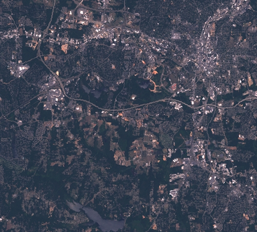
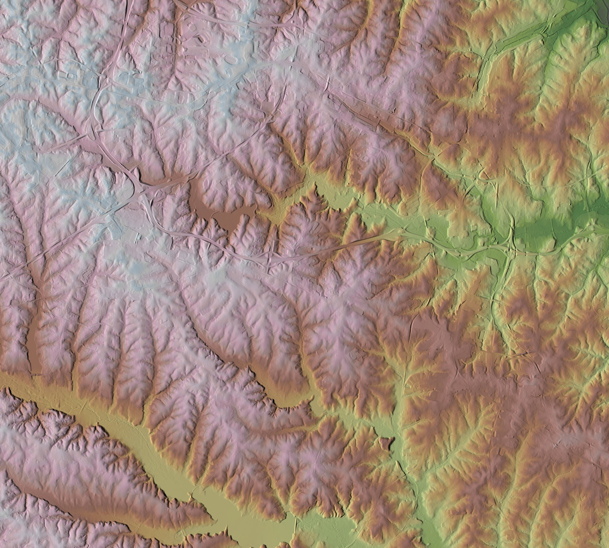

#<center>/[Notebooks](../../SUMMARY.md) / [Access to Geospatial data](../README.md)/</center>

# OSSIM Command Line Applications
The following command line applications are distributed with OSSIM.

##Core Programs

* [```ossim-info```](#ossim-info) Used to run ossim utilities function and to display metadata for imagery, maps, terrain, and vector data.
    * [Utility functions](#utilities-to-create-support-files)
        * [radians from degrees](#radians-from-degrees)
        * [degrees from radians](#degrees-from-radians)
        * [meters from feet](#meters-from-feet)
        * [meters to feet](#meters-to-feet)
        * [Meters per degree](#Meters-per-degrees)
        * [height](#height)
        * [Projections](#Projections)
        * [Datums](#Datums)
    * [Explore raster data](#Explore-raster-data)
        * [ground center](#ground-center)
        * [image center](#image-center)
        * [ground and image center](#ground-and-image-center)
        * [general image information](#general-image-information)
        * [meta data image information](#meta-data-image-information)
        * [image projection information](#image-projection-information)
        * [image rectangle](#image-rectangle)
        
* [```ossim-band-merge```](#ossim-band-merge) Merge multiple image files into a single n-band dataset.
* [```ossim-chipper```](#ossim-chipper) Render elevation data (e.g. shaded relief).
* [```ossim-icp```](#ossim-icp) Convert an image from one format to another.
* [```ossim-igen```](#ossim-igen) Execute image chains specified in a spec file.
* [```ossim-orthoigen```](#ossim-orthoigen) Tool to orthorectify, mosaic, and convert raster data between different formats. It provides a number of operations including subsetting, resampling, histogram matching, and reprojection of data.
* [```ossim-rpf```](#ossim-rpf) Various utilities for managing RPF data.

#Utilities to Create Support Files

The following tools are used to create OSSIM support files:

* [```ossim-cmm```]() Determine the min/max pixel values of an image.
* [```ossim-create-histo```]() Compute a histogram for an image.
* [```ossim-img2md```]() Create meta data files.
* [```ossim-img2rr```]() Create reduced resolution data sets for an image.
* [```ossim-tfw2ogeom```]() Create a geom file from a TIFF World File.
* [```ossim-extract-vertices```]() Compute the valid vertices (corners) of an image.
* [```ossim-preproc```]() Create reduced resolution data sets, histograms, and so on. Application does directory walking and is threaded at a file level.
* [```ossim-applanix2ogeom```]() Create a geom file for Applanix Images.
* [```ossim-create-cg```]() Create an ossim coarse grid.
* [```ossim-ecg2ocg```]() Convert an enhanced coarse grid to an ossim coarse grid.

# ```ossim-info```

[top](#core-programs)


    # we'll use the north_carolina image dataset
    ls /home/user/data/north_carolina/rast_geotiff | grep tif 

    aspect.tif
    basin_50K.tif
    cfactorbare_1m.tif
    cfactorgrow_1m.tif
    elevation_shade.tif
    elevation.tif
    elev_lid792_1m.tif
    elevlid_D782_6.tif
    elevlid_D783_6m.tif
    elevlid_D792_6m.tif
    elevlid_D793_6m.tif
    elev_ned_30m.tif
    elev_srtm_30m.tif
    elev_state_500m.tif
    facility.tif
    geology_30m.tif
    lakes.tif
    landclass96.tif
    landcover_1m.tif
    landuse96_28m.tif
    lsat7_2002_10.tif
    lsat7_2002_20.tif
    lsat7_2002_30.tif
    lsat7_2002_40.tif
    lsat7_2002_50.tif
    lsat7_2002_61.tif
    lsat7_2002_62.tif
    lsat7_2002_70.tif
    lsat7_2002_80.tif
    ortho_2001_t792_1m.tif
    roadsmajor.tif
    slope.tif
    soilsID.tif
    soils_Kfactor.tif
    streams_derived.tif
    towns.tif
    urban.tif
    zipcodes.tif


    ossim-info

    Usage: ossim-info [options] <optional-image>
    Options:
      --cg                 Will print out ground center.
      --ci                 Will print out image center.
      --config             Displays configuration info.
      --datums             Prints datum list.
      --deg2rad            <degrees> Gives radians from degrees.
      --disable-elev       Will disable the elevation
      --disable-notify     Takes an argument. Arguments are ALL, WARN, NOTICE, INFO,
                           FATAL, DEBUG.  If you want multiple disables then just do
                           multiple --disable-notify on the command line.  All
                           argument are case insensitive.  Default is all are
                           enabled.
      --disable-plugin     Will disable the plugin loader
      --dno                A generic dump if one is available.  This option ignores
                           overviews.
      --factories          <keyword_list_flag> Prints factory list.  If
                           keyword_list_flag is true, the result of a saveState will
                           be output for each object.
      --ft2mtrs            <feet> Gives meters from feet (0.3048 meters per foot).
      --ft2mtrs-us-survey  <feet> Gives meters from feet (0.3048006096 meters per
                           foot).
      --height             <latitude-in-degrees> <longitude-in-degrees> Returns the
                           MSL and ellipoid height given a latitude longitude
                           position.
      --mtrs2ft            <meters> Gives feet from meters (0.3048 meters per foot).
      --mtrs2ft-us-survey  <meters> Gives feet from meters (0.3048006096 meters per
                           foot).
      --mtrsPerDeg         <latitude> Gives meters per degree and meters per minute
                           for a given latitude.
      --ossim-logfile      takes a logfile as an argument.  All output messages are
                           redirected to the specified log file.  By default there
                           is no log file and all messages are enabled.
      --overview-types     Prints overview builder types.
      --palette            Will print out the color palette if one exists.
      --plugin-test        Test plugin passed to option.
      --plugins            Prints plugin list.
      --projections        Prints projections.
      --rad2deg            <radians> Gives degrees from radians.
      --reader-props       Prints readers and properties.
      --resampler-filters  Prints resampler filter list.
      --writer-props       Prints writers and properties.
      --writers            Prints list of available writers.
      -K                   specify individual keywords to add to the preferences
                           keyword list: name=value
      -P                   specify a preference file to load
      -T                   specify the classes to trace, ex: ossimInit|ossimImage.* 
                           will trace ossimInit and all ossimImage classes
      -V or --version      Display version information.
      -c                   Will print ground and image center.
      -d                   A generic dump if one is available.
      -f                   <format> Will output the information specified format
                           [KWL | XML].  Default is KWL.
      -h                   Display this information
      -i                   Will print out the general image information.
      -m                   Will print out meta data image information.
      -o                   <output-file> Will output the information to the file
                           specified.  Default is to standard out.
      -p                   Will print out the image projection information.
      -r                   Will print image rectangle.
      -s                   Force the ground rect to be the specified datum
      -u or --up-is-up     Rotation angle to "up is up" for an image.
                           Will return 0 if image's projection is not affected by
                           elevation.
      -v                   Overwrite existing geometry.
    
     examples:
    
        ossim-info --version
        ossim-info -i ./myfile.tif
          prints out only general image information
    
        ossim-info -p ./myfile.tif
          prints out only image projection information
    
        ossim-info -p -s wge ./myfile.tif
          prints out only image projection information and shifts to wgs84
    
        ossim-info -p -i ./myfile.tif
          prints out both image and projection information
    
        ossim-info -p -i ./myfile.tif -o ./myfile.geom
          writes geometry file with both image and projection information
    
        ossim-info -p -i ./myfile.tif -v -o ./myfile.geom
          writes geometry file with both image and projection information
          while overwriting existing .geom file.
    
        ossim-info -f XML ./myfile.tif
          prints out image and projection information as an XML document
    
        ossim-info -d myfile.ntf
          Dumps all data available, in this case, all nitf tags, from file.
    
        ossim-info -d a.toc
          Dumps all data available, in this case, all nitf and rpf tags, from file.
    
        ossim-info --dno a.toc
          "dno" for "dump no overviws" Dumps all data available,
           in this case, all nitf and rpf tags, from file ignoring overviews.
    
        ossim-info -d -i -p myfile.ntf
          Typical usage case, i.e. do a dump of tags and print out image and
          projection information.
    
    


## Utility functions

### radians from degrees

```ossim-info --deg2rad <degrees>```


    ossim-info --deg2rad 20.54

    
    20.539999999999999 degrees = 0.358490628359635 radians.
    


[top](#core-programs)

### degrees from radians
   
```ossim-info --rad2deg <radians>```


    ossim-info --rad2deg 0.35849

    
    0.358490000000000 radians = 20.539963997644879 degrees.
    


[top](#core-programs)

### meters from feet 

- 0.3048 meters per foot

```ossim-info --ft2mtrs <feet>``` 


    ossim-info --ft2mtrs 1

    1.000000000000000 * 0.3048 = 0.304800000000000 meters.


- 0.3048006096 meters per foot
    
    ```ossim-info --ft2mtrs-us-survey <feet>``` 


    ossim-info --ft2mtrs-us-survey 1

    1.000000000000000 * 0.3048006096 = 0.304800609600000 meters.


[top](#core-programs)

### meters to feet
* 0.3048 meters per foot

    ```ossim-info --mtrs2ft <meters>```


    ossim-info --mtrs2ft 1

    1.000000000000000 / 0.3048 = 3.280839895013123 feet.


* 0.3048006096 meters per foot

    ```ossim-info --mtrs2ft-us-survey  <meters>```


    ossim-info --mtrs2ft-us-survey  1

    1.000000000000000 / 0.3048006096 = 3.280833333346457 feet.


[top](#core-programs)

### height
return the MSL and ellipoid height given a latitude longitude position

```ossim-info --height <latitude-in-degrees> <longitude-in-degrees>``` 


    # note we pass the path to the ossim_preference file to tell where the geoid file is
    ossim-info --height 47.54 157.40 -P /usr/local/share/ossim/ossim_preference

    Did not find cell for point: ( 47.539999999999999, 157.400000000000006, 0.000, WGE )
    MSL to ellipsoid delta: nan
    Height above MSL:       nan
    Height above ellipsoid: nan
    Geoid value:            11.361720008850108


[top](#core-programs)

### Meters per degrees
Gives meters per degree and meters per minute for a given latitude.   
```ossim-info --mtrsPerDeg <latitude>```


    ossim-info --mtrsPerDeg 65.45

    Meters per degree and minute at latitude of 65.450000000000003:
    Meters per degree latitude:   111011.137571255007060
    Meters per degree longitude:  46123.704016739531653
    Meters per minute latitude:   1850.185626187583466
    Meters per minute longitude:   768.728400278992240
    Geodetic radius:              6360469.661779075860977
    


[top](#core-programs)

### Datums

Prints datum list.

```ossim-info --datums```             


    ossim-info --datums

    6055   Popular Visualisation                           Ellipse:  Popular Visualization Sphere
    ADI-A  ADINDAN, Ethiopia                               Ellipse:  Clarke 1880
    ADI-B  ADINDAN, Sudan                                  Ellipse:  Clarke 1880
    ADI-C  ADINDAN, Mali                                   Ellipse:  Clarke 1880
    ADI-D  ADINDAN, Senegal                                Ellipse:  Clarke 1880
    ADI-E  ADINDAN, Burkina Faso                           Ellipse:  Clarke 1880
    ADI-F  ADINDAN, Cameroon                               Ellipse:  Clarke 1880
    ADI-M  ADINDAN, Mean                                   Ellipse:  Clarke 1880
    AFG    AFGOOYE, Somalia                                Ellipse:  Krassovsky
    AIA    ANTIGUA ISLAND ASTRO 1943                       Ellipse:  Clarke 1880
    AIN-A  AIN EL ABD 1970, Bahrain                        Ellipse:  International 1924
    AIN-B  AIN EL ABD 1970, Saudi Arabia                   Ellipse:  International 1924
    AMA    AMERICAN SAMOA 1962                             Ellipse:  Clarke 1866
    ANO    ANNA 1 ASTRO 1965, Cocos Is.                    Ellipse:  Australian National
    ARF-A  ARC 1950, Botswana                              Ellipse:  Clarke 1880
    ARF-B  ARC 1950, Lesotho                               Ellipse:  Clarke 1880
    ARF-C  ARC 1950, Malawi                                Ellipse:  Clarke 1880
    ARF-D  ARC 1950, Swaziland                             Ellipse:  Clarke 1880
    ARF-E  ARC 1950, Zaire                                 Ellipse:  Clarke 1880
    ARF-F  ARC 1950, Zambia                                Ellipse:  Clarke 1880
    ARF-G  ARC 1950, Zimbabwe                              Ellipse:  Clarke 1880
    ARF-H  ARC 1950, Burundi                               Ellipse:  Clarke 1880
    ARF-M  ARC 1950, Mean                                  Ellipse:  Clarke 1880
    ARS-A  ARC 1960, Kenya                                 Ellipse:  Clarke 1880
    ARS-B  ARC 1960, Tanzania                              Ellipse:  Clarke 1880
    ARS-M  ARC 1960, Kenya & Tanzania                      Ellipse:  Clarke 1880
    ASC    ASCENSION ISLAND 1958                           Ellipse:  International 1924
    ASM    MONTSERRAT ISLAND ASTRO 1958                    Ellipse:  Clarke 1880
    ASQ    ASTRO STATION 1952, Marcus Is.                  Ellipse:  International 1924
    ATF    ASTRO BEACON E 1845, Iwo Jima                   Ellipse:  International 1924
    AUA    AUSTRALIAN GEODETIC 1966                        Ellipse:  Australian National
    AUG    AUSTRALIAN GEODETIC 1984                        Ellipse:  Australian National
    BAT    DJAKARTA, INDONESIA                             Ellipse:  Bessel 1841
    BER    BERMUDA 1957, Bermuda Islands                   Ellipse:  Clarke 1866
    BID    BISSAU, Guinea-Bissau                           Ellipse:  International 1924
    BOO    BOGOTA OBSERVATORY, Columbia                    Ellipse:  International 1924
    BUR    BUKIT RIMPAH, Banka & Belitung                  Ellipse:  Bessel 1841
    CAC    CAPE CANAVERAL, Fla & Bahamas                   Ellipse:  Clarke 1866
    CAI    CAMPO INCHAUSPE 1969, Arg.                      Ellipse:  International 1924
    CAO    CANTON ASTRO 1966, Phoenix Is.                  Ellipse:  International 1924
    CAP    CAPE, South Africa                              Ellipse:  Clarke 1880
    CAZ    CAMP AREA ASTRO, Camp McMurdo                   Ellipse:  International 1924
    CCD    S-JTSK, Czech Republic                          Ellipse:  Bessel 1841
    CGE    CARTHAGE, Tunisia                               Ellipse:  Clarke 1880
    CHI    CHATHAM ISLAND ASTRO 1971, NZ                   Ellipse:  International 1924
    CHU    CHUA ASTRO, Paraguay                            Ellipse:  International 1924
    COA    CORREGO ALEGRE, Brazil                          Ellipse:  International 1924
    DAL    DABOLA, Guinea                                  Ellipse:  Clarke 1880
    DID    DECEPTION ISLAND                                Ellipse:  Clarke 1880
    DOB    GUX 1 ASTRO, Guadalcanal Is.                    Ellipse:  International 1924
    EAS    EASTER ISLAND 1967                              Ellipse:  International 1924
    ENW    WAKE-ENIWETOK 1960                              Ellipse:  Hough
    EST    ESTONIA, 1937                                   Ellipse:  Bessel 1841
    EUR-7  EUROPEAN 1950, Mean (7 Param)                   Ellipse:  International 1924
    EUR-A  EUROPEAN 1950, Western Europe                   Ellipse:  International 1924
    EUR-B  EUROPEAN 1950, Greece                           Ellipse:  International 1924
    EUR-C  EUROPEAN 1950, Norway & Finland                 Ellipse:  International 1924
    EUR-D  EUROPEAN 1950, Portugal & Spain                 Ellipse:  International 1924
    EUR-E  EUROPEAN 1950, Cyprus                           Ellipse:  International 1924
    EUR-F  EUROPEAN 1950, Egypt                            Ellipse:  International 1924
    EUR-G  EUROPEAN 1950, England, Channel                 Ellipse:  International 1924
    EUR-H  EUROPEAN 1950, Iran                             Ellipse:  International 1924
    EUR-I  EUROPEAN 1950, Sardinia(Italy)                  Ellipse:  International 1924
    EUR-J  EUROPEAN 1950, Sicily(Italy)                    Ellipse:  International 1924
    EUR-K  EUROPEAN 1950, England, Ireland                 Ellipse:  International 1924
    EUR-L  EUROPEAN 1950, Malta                            Ellipse:  International 1924
    EUR-M  EUROPEAN 1950, Mean (3 Param)                   Ellipse:  International 1924
    EUR-S  EUROPEAN 1950, Iraq, Israel                     Ellipse:  International 1924
    EUR-T  EUROPEAN 1950, Tunisia                          Ellipse:  International 1924
    EUS    EUROPEAN 1979                                   Ellipse:  International 1924
    FAH    OMAN                                            Ellipse:  Clarke 1880
    FLO    OBSERVATORIO MET. 1939, Flores                  Ellipse:  International 1924
    FOT    FORT THOMAS 1955, Leeward Is.                   Ellipse:  Clarke 1880
    GAA    GAN 1970, Rep. of Maldives                      Ellipse:  International 1924
    GEO    GEODETIC DATUM 1949, NZ                         Ellipse:  International 1924
    GIZ    DOS 1968, Gizo Island                           Ellipse:  International 1924
    GRA    GRACIOSA BASE SW 1948, Azores                   Ellipse:  International 1924
    GSE    GUNUNG SEGARA, Indonesia                        Ellipse:  Bessel 1841
    GUA    GUAM 1963                                       Ellipse:  Clarke 1866
    HEN    HERAT NORTH, Afghanistan                        Ellipse:  International 1924
    HER    HERMANNSKOGEL, old Yugoslavia                   Ellipse:  Bessel 1841
    HIT    PROVISIONAL SOUTH CHILEAN 1963                  Ellipse:  International 1924
    HJO    HJORSEY 1955, Iceland                           Ellipse:  International 1924
    HKD    HONG KONG 1963                                  Ellipse:  International 1924
    HTN    HU-TZU-SHAN, Taiwan                             Ellipse:  International 1924
    IBE    BELLEVUE (IGN), Efate Is.                       Ellipse:  International 1924
    IDN    INDONESIAN 1974                                 Ellipse:  Indonesian 1974
    IND-B  INDIAN, Bangladesh                              Ellipse:  Everest
    IND-I  INDIAN, India & Nepal                           Ellipse:  Everest 1956 (India)
    IND-P  INDIAN, Pakistan                                Ellipse:  Everest
    INF-A  INDIAN 1954, Thailand                           Ellipse:  Everest
    ING-A  INDIAN 1960, Vietnam 16N                        Ellipse:  Everest
    ING-B  INDIAN 1960, Con Son Island                     Ellipse:  Everest
    INH-A  INDIAN 1975, Thailand                           Ellipse:  Everest
    INH-A1 INDIAN 1975, Thailand                           Ellipse:  Everest
    IRL    IRELAND 1965                                    Ellipse:  Modified Airy
    ISG    ISTS 061 ASTRO 1968, S Georgia                  Ellipse:  International 1924
    IST    ISTS 073 ASTRO 1969, Diego Garc                 Ellipse:  International 1924
    JOH    JOHNSTON ISLAND 1961                            Ellipse:  International 1924
    KAN    KANDAWALA, Sri Lanka                            Ellipse:  Everest
    KEA    KERTAU 1948, W Malaysia & Sing.                 Ellipse:  Everest 1948(W.Mals. & Sing.)
    KEG    KERGUELEN ISLAND 1949                           Ellipse:  International 1924
    KUS    KUSAIE ASTRO 1951, Caroline Is.                 Ellipse:  International 1924
    LCF    L.C. 5 ASTRO 1961, Cayman Brac                  Ellipse:  Clarke 1866
    LEH    LEIGON, Ghana                                   Ellipse:  Clarke 1880
    LIB    LIBERIA 1964                                    Ellipse:  Clarke 1880
    LUZ-A  LUZON, Phillipines                              Ellipse:  Clarke 1866
    LUZ-B  LUZON, Mindanao Island                          Ellipse:  Clarke 1866
    MAS    MASSAWA, Ethiopia                               Ellipse:  Bessel 1841
    MER    MERCHICH, Morocco                               Ellipse:  Clarke 1880
    MID    MIDWAY ASTRO 1961, Midway Is.                   Ellipse:  International 1924
    MIK    MAHE 1971, Mahe Is.                             Ellipse:  Clarke 1880
    MIN-A  MINNA, Cameroon                                 Ellipse:  Clarke 1880
    MIN-B  MINNA, Nigeria                                  Ellipse:  Clarke 1880
    MOD    ROME 1940, Sardinia                             Ellipse:  International 1924
    MPO    M'PORALOKO, Gabon                               Ellipse:  Clarke 1880
    MVS    VITI LEVU 1916, Viti Levu Is.                   Ellipse:  Clarke 1880
    NAH-A  NAHRWAN, Masirah Island (Oman)                  Ellipse:  Clarke 1880
    NAH-B  NAHRWAN, United Arab Emirates                   Ellipse:  Clarke 1880
    NAH-C  NAHRWAN, Saudi Arabia                           Ellipse:  Clarke 1880
    NAP    NAPARIMA, Trinidad & Tobago                     Ellipse:  International 1924
    NAR-A  NORTH AMERICAN 1983, Alaska                     Ellipse:  GRS 80
    NAR-B  NORTH AMERICAN 1983, Canada                     Ellipse:  GRS 80
    NAR-C  NORTH AMERICAN 1983, CONUS                      Ellipse:  GRS 80
    NAR-D  NORTH AMERICAN 1983, Mexico                     Ellipse:  GRS 80
    NAR-E  NORTH AMERICAN 1983, Aleutian                   Ellipse:  GRS 80
    NAR-H  NORTH AMERICAN 1983, Hawai'i                    Ellipse:  GRS 80
    NAS-A  NORTH AMERICAN 1927, Eastern US                 Ellipse:  Clarke 1866
    NAS-B  NORTH AMERICAN 1927, Western US                 Ellipse:  Clarke 1866
    NAS-C  NORTH AMERICAN 1927, CONUS                      Ellipse:  Clarke 1866
    NAS-D  NORTH AMERICAN 1927, Alaska                     Ellipse:  Clarke 1866
    NAS-E  NORTH AMERICAN 1927, Canada                     Ellipse:  Clarke 1866
    NAS-F  NORTH AMERICAN 1927, Alberta/BC                 Ellipse:  Clarke 1866
    NAS-G  NORTH AMERICAN 1927, E. Canada                  Ellipse:  Clarke 1866
    NAS-H  NORTH AMERICAN 1927, Man/Ont                    Ellipse:  Clarke 1866
    NAS-I  NORTH AMERICAN 1927, NW Terr.                   Ellipse:  Clarke 1866
    NAS-J  NORTH AMERICAN 1927, Yukon                      Ellipse:  Clarke 1866
    NAS-L  NORTH AMERICAN 1927, Mexico                     Ellipse:  Clarke 1866
    NAS-N  NORTH AMERICAN 1927, C. America                 Ellipse:  Clarke 1866
    NAS-O  NORTH AMERICAN 1927, Canal Zone                 Ellipse:  Clarke 1866
    NAS-P  NORTH AMERICAN 1927, Caribbean                  Ellipse:  Clarke 1866
    NAS-Q  NORTH AMERICAN 1927, Bahamas                    Ellipse:  Clarke 1866
    NAS-R  NORTH AMERICAN 1927, San Salv.                  Ellipse:  Clarke 1866
    NAS-T  NORTH AMERICAN 1927, Cuba                       Ellipse:  Clarke 1866
    NAS-U  NORTH AMERICAN 1927, Greenland                  Ellipse:  Clarke 1866
    NAS-V  NORTH AMERICAN 1927, Aleutian E                 Ellipse:  Clarke 1866
    NAS-W  NORTH AMERICAN 1927, Aleutian W                 Ellipse:  Clarke 1866
    NSD    NORTH SAHARA 1959, Algeria                      Ellipse:  Clarke 1880
    NTF    NOUVELLE TRIANGULATION DE LA FRANCE, FRANCE     Ellipse:  Clarke 1880 (IGN)EPSG 7011
    OEG    OLD EGYPTIAN 1907                               Ellipse:  Helmert 1906
    OGB-7  ORDNANCE GB 1936, Mean (7 Para)                 Ellipse:  Airy
    OGB-A  ORDNANCE GB 1936, England                       Ellipse:  Airy
    OGB-B  ORDNANCE GB 1936, Eng., Wales                   Ellipse:  Airy
    OGB-C  ORDNANCE GB 1936, Scotland                      Ellipse:  Airy
    OGB-D  ORDNANCE GB 1936, Wales                         Ellipse:  Airy
    OGB-M  ORDNANCE GB 1936, Mean (3 Para)                 Ellipse:  Airy
    OHA-A  OLD HAWAI'IAN (CC), Hawai'i                     Ellipse:  Clarke 1866
    OHA-B  OLD HAWAI'IAN (CC), Kauai                       Ellipse:  Clarke 1866
    OHA-C  OLD HAWAI'IAN (CC), Maui                        Ellipse:  Clarke 1866
    OHA-D  OLD HAWAI'IAN (CC), Oahu                        Ellipse:  Clarke 1866
    OHA-M  OLD HAWAI'IAN (CC), Mean                        Ellipse:  Clarke 1866
    OHI-A  OLD HAWAI'IAN (IN), Hawai'i                     Ellipse:  International 1924
    OHI-B  OLD HAWAI'IAN (IN), Kauai                       Ellipse:  International 1924
    OHI-C  OLD HAWAI'IAN (IN), Maui                        Ellipse:  International 1924
    OHI-D  OLD HAWAI'IAN (IN), Oahu                        Ellipse:  International 1924
    OHI-M  OLD HAWAI'IAN (IN), Mean                        Ellipse:  International 1924
    PHA    AYABELLA LIGHTHOUSE, Bjibouti                   Ellipse:  Clarke 1880
    PIT    PITCAIRN ASTRO 1967                             Ellipse:  International 1924
    PLN    PICO DE LAS NIEVES, Canary Is.                  Ellipse:  International 1924
    POS    PORTO SANTO 1936, Madeira Is.                   Ellipse:  International 1924
    PRP-A  PROV. S AMERICAN 1956, Bolivia                  Ellipse:  International 1924
    PRP-B  PROV. S AMERICAN 1956, N Chile                  Ellipse:  International 1924
    PRP-C  PROV. S AMERICAN 1956, S Chile                  Ellipse:  International 1924
    PRP-D  PROV. S AMERICAN 1956, Colombia                 Ellipse:  International 1924
    PRP-E  PROV. S AMERICAN 1956, Ecuador                  Ellipse:  International 1924
    PRP-F  PROV. S AMERICAN 1956, Guyana                   Ellipse:  International 1924
    PRP-G  PROV. S AMERICAN 1956, Peru                     Ellipse:  International 1924
    PRP-H  PROV. S AMERICAN 1956, Venez                    Ellipse:  International 1924
    PRP-M  PROV. S AMERICAN 1956, Mean                     Ellipse:  International 1924
    PTB    POINT 58, Burkina Faso & Niger                  Ellipse:  Clarke 1880
    PTN    POINT NOIRE 1948                                Ellipse:  Clarke 1880
    PUK    PULKOVO 1942, Russia                            Ellipse:  Krassovsky
    PUR    PUERTO RICO & Virgin Is.                        Ellipse:  Clarke 1866
    QAT    QATAR NATIONAL                                  Ellipse:  International 1924
    QUO    QORNOQ, South Greenland                         Ellipse:  International 1924
    REU    REUNION, Mascarene Is.                          Ellipse:  International 1924
    SAE    SANTO (DOS) 1965                                Ellipse:  International 1924
    SAN-A  SOUTH AMERICAN 1969, Argentina                  Ellipse:  South American 1969
    SAN-B  SOUTH AMERICAN 1969, Bolivia                    Ellipse:  South American 1969
    SAN-C  SOUTH AMERICAN 1969, Brazil                     Ellipse:  South American 1969
    SAN-D  SOUTH AMERICAN 1969, Chile                      Ellipse:  South American 1969
    SAN-E  SOUTH AMERICAN 1969, Colombia                   Ellipse:  South American 1969
    SAN-F  SOUTH AMERICAN 1969, Ecuador                    Ellipse:  South American 1969
    SAN-G  SOUTH AMERICAN 1969, Guyana                     Ellipse:  South American 1969
    SAN-H  SOUTH AMERICAN 1969, Paraguay                   Ellipse:  South American 1969
    SAN-I  SOUTH AMERICAN 1969, Peru                       Ellipse:  South American 1969
    SAN-J  SOUTH AMERICAN 1969, Baltra                     Ellipse:  South American 1969
    SAN-K  SOUTH AMERICAN 1969, Trinidad                   Ellipse:  South American 1969
    SAN-L  SOUTH AMERICAN 1969, Venezuela                  Ellipse:  South American 1969
    SAN-M  SOUTH AMERICAN 1969, Mean                       Ellipse:  South American 1969
    SAO    SAO BRAZ, Santa Maria Is.                       Ellipse:  International 1924
    SAP    SAPPER HILL 1943, E Falkland Is                 Ellipse:  International 1924
    SCK    SCHWARZECK, Namibia                             Ellipse:  Bessel 1841(Namibia)
    SGM    SELVAGEM GRADE 1938, Salvage Is                 Ellipse:  International 1924
    SHB    ASTRO DOS 71/4, St. Helena Is.                  Ellipse:  International 1924
    SOA    SOUTH ASIA, Singapore                           Ellipse:  Mod. Fischer 1960(South Asia)
    SPK-A  S-42 (PULKOVO 1942), Hungary                    Ellipse:  Krassovsky
    SPK-B  S-42 (PULKOVO 1942), Poland                     Ellipse:  Krassovsky
    SPK-C  S-42 (PK42) Former Czechoslov.                  Ellipse:  Krassovsky
    SPK-D  S-42 (PULKOVO 1942), Latvia                     Ellipse:  Krassovsky
    SPK-E  S-42 (PK 1942), Kazakhstan                      Ellipse:  Krassovsky
    SPK-F  S-42 (PULKOVO 1942), Albania                    Ellipse:  Krassovsky
    SPK-G  S-42 (PULKOVO 1942), Romania                    Ellipse:  Krassovsky
    SRL    SIERRA LEONE 1960                               Ellipse:  Clarke 1880
    TAN    TANANARIVE OBSERVATORY 1925                     Ellipse:  International 1924
    TDC    TRISTAN ASTRO 1968                              Ellipse:  International 1924
    TIL    TIMBALAI 1948, Brunei & E Malay                 Ellipse:  Everest
    TOY-A  TOKYO, Japan                                    Ellipse:  Bessel 1841
    TOY-B  TOKYO, South Korea                              Ellipse:  Bessel 1841
    TOY-B1 TOKYO, South Korea                              Ellipse:  Bessel 1841
    TOY-C  TOKYO, Okinawa                                  Ellipse:  Bessel 1841
    TOY-M  TOKYO, Mean                                     Ellipse:  Bessel 1841
    TRN    ASTRO TERN ISLAND (FRIG) 1961                   Ellipse:  International 1924
    VOI    VOIROL 1874, Algeria                            Ellipse:  Clarke 1880
    VOR    VOIROL 1960, Algeria                            Ellipse:  Clarke 1880
    WAK    WAKE ISLAND ASTRO 1952                          Ellipse:  International 1924
    WGD    World Geodetic System 1972                      Ellipse:  WGS 72
    WGE    World Geodetic System 1984                      Ellipse:  WGS 84
    YAC    YACARE, Uruguay                                 Ellipse:  International 1924
    ZAN    ZANDERIJ, Suriname                              Ellipse:  International 1924
    OHI-M  OLD HAWAI'IAN (IN), Mean                        Ellipse:  International 1924
    PUR    PUERTO RICO & Virgin Is.                        Ellipse:  Clarke 1866
    NAR-C  NORTH AMERICAN 1983, CONUS                      Ellipse:  GRS 80
    EUR-M  EUROPEAN 1950, Mean (3 Param)                   Ellipse:  International 1924
    DAL    DABOLA, Guinea                                  Ellipse:  Clarke 1880
    CCD    S-JTSK, Czech Republic                          Ellipse:  Bessel 1841
    NAP    NAPARIMA, Trinidad & Tobago                     Ellipse:  International 1924
    BID    BISSAU, Guinea-Bissau                           Ellipse:  International 1924
    AMA    AMERICAN SAMOA 1962                             Ellipse:  Clarke 1866
    SRL    SIERRA LEONE 1960                               Ellipse:  Clarke 1880
    ADI-M  ADINDAN, Mean                                   Ellipse:  Clarke 1880
    AUA    AUSTRALIAN GEODETIC 1966                        Ellipse:  Australian National
    AUG    AUSTRALIAN GEODETIC 1984                        Ellipse:  Australian National
    AIN-A  AIN EL ABD 1970, Bahrain                        Ellipse:  International 1924
    AFG    AFGOOYE, Somalia                                Ellipse:  Krassovsky
    ARF-M  ARC 1950, Mean                                  Ellipse:  Clarke 1880
    ARS-M  ARC 1960, Kenya & Tanzania                      Ellipse:  Clarke 1880
    BER    BERMUDA 1957, Bermuda Islands                   Ellipse:  Clarke 1866
    BOO    BOGOTA OBSERVATORY, Columbia                    Ellipse:  International 1924
    BUR    BUKIT RIMPAH, Banka & Belitung                  Ellipse:  Bessel 1841
    CAI    CAMPO INCHAUSPE 1969, Arg.                      Ellipse:  International 1924
    CAP    CAPE, South Africa                              Ellipse:  Clarke 1880
    CGE    CARTHAGE, Tunisia                               Ellipse:  Clarke 1880
    CHU    CHUA ASTRO, Paraguay                            Ellipse:  International 1924
    HTN    HU-TZU-SHAN, Taiwan                             Ellipse:  International 1924
    IDN    INDONESIAN 1974                                 Ellipse:  Indonesian 1974
    INF-A  INDIAN 1954, Thailand                           Ellipse:  Everest
    INH-A  INDIAN 1975, Thailand                           Ellipse:  Everest
    KAN    KANDAWALA, Sri Lanka                            Ellipse:  Everest
    KEA    KERTAU 1948, W Malaysia & Sing.                 Ellipse:  Everest 1948(W.Mals. & Sing.)
    PRP-M  PROV. S AMERICAN 1956, Mean                     Ellipse:  International 1924
    LEH    LEIGON, Ghana                                   Ellipse:  Clarke 1880
    LIB    LIBERIA 1964                                    Ellipse:  Clarke 1880
    LUZ-A  LUZON, Phillipines                              Ellipse:  Clarke 1866
    HEN    HERAT NORTH, Afghanistan                        Ellipse:  International 1924
    MIK    MAHE 1971, Mahe Is.                             Ellipse:  Clarke 1880
    MER    MERCHICH, Morocco                               Ellipse:  Clarke 1880
    MAS    MASSAWA, Ethiopia                               Ellipse:  Bessel 1841
    MIN-A  MINNA, Cameroon                                 Ellipse:  Clarke 1880
    MPO    M'PORALOKO, Gabon                               Ellipse:  Clarke 1880
    NAS-C  NORTH AMERICAN 1927, CONUS                      Ellipse:  Clarke 1866
    NAR-C  NORTH AMERICAN 1983, CONUS                      Ellipse:  GRS 80
    NAH-C  NAHRWAN, Saudi Arabia                           Ellipse:  Clarke 1880
    PTN    POINT NOIRE 1948                                Ellipse:  Clarke 1880
    PUK    PULKOVO 1942, Russia                            Ellipse:  Krassovsky
    QAT    QATAR NATIONAL                                  Ellipse:  International 1924
    QUO    QORNOQ, South Greenland                         Ellipse:  International 1924
    SAP    SAPPER HILL 1943, E Falkland Is                 Ellipse:  International 1924
    SCK    SCHWARZECK, Namibia                             Ellipse:  Bessel 1841(Namibia)
    TAN    TANANARIVE OBSERVATORY 1925                     Ellipse:  International 1924
    TIL    TIMBALAI 1948, Brunei & E Malay                 Ellipse:  Everest
    TOY-M  TOKYO, Mean                                     Ellipse:  Bessel 1841
    VOI    VOIROL 1874, Algeria                            Ellipse:  Clarke 1880
    NSD    NORTH SAHARA 1959, Algeria                      Ellipse:  Clarke 1880
    YAC    YACARE, Uruguay                                 Ellipse:  International 1924
    ZAN    ZANDERIJ, Suriname                              Ellipse:  International 1924
    WGD    World Geodetic System 1972                      Ellipse:  WGS 72
    WGE    World Geodetic System 1984                      Ellipse:  WGS 84
    AIA    ANTIGUA ISLAND ASTRO 1943                       Ellipse:  Clarke 1880
    ASM    MONTSERRAT ISLAND ASTRO 1958                    Ellipse:  Clarke 1880
    HKD    HONG KONG 1963                                  Ellipse:  International 1924
    GSE    GUNUNG SEGARA, Indonesia                        Ellipse:  Bessel 1841
    POS    PORTO SANTO 1936, Madeira Is.                   Ellipse:  International 1924
    SGM    SELVAGEM GRADE 1938, Salvage Is                 Ellipse:  International 1924
    SAN-M  SOUTH AMERICAN 1969, Mean                       Ellipse:  South American 1969
    HJO    HJORSEY 1955, Iceland                           Ellipse:  International 1924
    EUS    EUROPEAN 1979                                   Ellipse:  International 1924
    NTF    NOUVELLE TRIANGULATION DE LA FRANCE, FRANCE     Ellipse:  Clarke 1880 (IGN)EPSG 7011


### Projections

Prints projections list

```ossim-info --projections```       


    ossim-info --projections

    Projections:
    ossimApplanixEcefModel
    ossimApplanixUtmModel
    ossimCoarseGridModel
    ossimRpcModel
    ossimIkonosRpcModel
    ossimQuickbirdRpcModel
    ossimNitfRpcModel
    ossimLandSatModel
    ossimNitfMapModel
    ossimFcsiModel
    ossimSpot5Model
    ossimSarModel
    ossimSensorModel
    ossimBuckeyeSensor
    ossimSkyBoxLearSensor
    ossimIpodSensor
    ossimPpjFrameSensor
    ossimAlphaSensorHRI
    ossimAlphaSensorHSI
    ossimAlbersProjection
    ossimAzimEquDistProjection
    ossimBonneProjection
    ossimBngProjection
    ossimCassiniProjection
    ossimCylEquAreaProjection
    ossimEquDistCylProjection
    ossimEckert4Projection
    ossimEckert6Projection
    ossimGnomonicProjection
    ossimLambertConformalConicProjection
    ossimLlxyProjection
    ossimMercatorProjection
    ossimMillerProjection
    ossimMollweidProjection
    ossimNewZealandMapGridProjection
    ossimObliqueMercatorProjection
    ossimOrthoGraphicProjection
    ossimPolarStereoProjection
    ossimPolyconicProjection
    ossimSinusoidalProjection
    ossimStereographicProjection
    ossimTransCylEquAreaProjection
    ossimTransMercatorProjection
    ossimUpsProjection
    ossimUtmProjection
    ossimVanDerGrintenProjection
    ossimSpaceObliqueMercatorProjection
    ossimGoogleProjection
    ossimSonomaSensor
    ossimAffineProjection
    ossimBilinearProjection
    ossimRpcProjection
    ossimQuadProjection
    ossimWarpProjection
    ossimPolynomProjection
    


[top](#core-programs)

## Explore raster data

### ground center

```ossim-info --cg filename```


    ossim-info --cg /home/user/data/north_carolina/rast_geotiff/lsat7_2002_10.tif

    image0.center_ground:  (35.7485351201524,-78.6914994603972,nan,NAR-C)
    


[top](#core-programs)

### image center

```ossim-info  --ci filename```         


    ossim-info  --ci /home/user/data/north_carolina/rast_geotiff/lsat7_2002_10.tif

    image0.center_image:  (263,237)
    


[top](#Core-Programs)

### ground and image center

```ossim-info -c filename```


    ossim-info  -c /home/user/data/north_carolina/rast_geotiff/lsat7_2002_10.tif      

    image0.center_ground:  (35.7485351201524,-78.6914994603972,nan,NAR-C)
    image0.center_image:  (263,237)
    


[top](#core-programs)

### general image information
    
```ossim-info -i filename```


    ossim-info  -i /home/user/data/north_carolina/rast_geotiff/lsat7_2002_10.tif      

    image0.band0.max_value:  255
    image0.band0.min_value:  1
    image0.band0.null_value:  0
    image0.driver:  ossim_tiff
    image0.entry:  0
    image0.lr_x:  526
    image0.lr_y:  474
    image0.number_decimation_levels:  5
    image0.number_input_bands:  1
    image0.number_lines:  475
    image0.number_output_bands:  1
    image0.number_samples:  527
    image0.overview.type:  ossimTiffTileSource
    image0.radiometry:  8-bit
    image0.type:  ossimTiffTileSource
    image0.ul_x:  0
    image0.ul_y:  0
    number_entries:  1
    


[top](#core-programs)

### meta data image information

```ossim-info -m filename```


    ossim-info  -m /home/user/data/north_carolina/rast_geotiff/lsat7_2002_10.tif      

    Description:  
    apply_color_palette_flag:  true
    class_name:  ossimTiffTileSource
    enabled:  true
    entry:  0
    file_type:  TIFF
    number_bands:  1
    number_lines:  475
    number_reduced_res_sets:  5
    number_samples:  527
    open_overview_flag:  true
    scalar_type:  ossim_uint8
    


[top](#core-programs)

### image projection information

```ossim-info -p filename```


    ossim-info  -p /home/user/data/north_carolina/rast_geotiff/lsat7_2002_10.tif      

    image0.geometry.decimal_degrees_per_pixel_lat:  0.000256884774141668
    image0.geometry.decimal_degrees_per_pixel_lon:  0.000315358474811436
    image0.geometry.decimations:  (1,1) (0.5,0.5) (0.25,0.25) (0.125,0.125) (0.0625,0.0625)
    image0.geometry.gsd:  (28.5,28.5)
    image0.geometry.image_size:  (527,475)
    image0.geometry.ll_lat:  35.6878345954377
    image0.geometry.ll_lon:  -78.7745461737129
    image0.geometry.lr_lat:  35.6874149879091
    image0.geometry.lr_lon:  -78.6089170160803
    image0.geometry.meters_per_pixel_x:  28.5
    image0.geometry.meters_per_pixel_y:  28.5
    image0.geometry.projection.central_meridian:  -79
    image0.geometry.projection.datum:  NAR-C
    image0.geometry.projection.elevation_lookup_flag:  0
    image0.geometry.projection.ellipse_code:  RF
    image0.geometry.projection.ellipse_epsg_code:  7019
    image0.geometry.projection.ellipse_name:  GRS 80
    image0.geometry.projection.false_easting_northing:  (609601.22,0)
    image0.geometry.projection.false_easting_northing_units:  meters
    image0.geometry.projection.major_axis:  6378137
    image0.geometry.projection.minor_axis:  6356752.3141
    image0.geometry.projection.origin_latitude:  33.75
    image0.geometry.projection.pcs_code:  0
    image0.geometry.projection.pixel_scale_units:  meters
    image0.geometry.projection.pixel_scale_xy:  (28.5,28.5)
    image0.geometry.projection.std_parallel_1:  36.1666666666667
    image0.geometry.projection.std_parallel_2:  34.3333333333333
    image0.geometry.projection.tie_point_units:  meters
    image0.geometry.projection.tie_point_xy:  (630006.75,228498.75)
    image0.geometry.projection.type:  ossimLambertConformalConicProjection
    image0.geometry.target_rrds:  0
    image0.geometry.tie_point_lat:  35.8095979783809
    image0.geometry.tie_point_lon:  -78.7742066855997
    image0.geometry.type:  ossimImageGeometry
    image0.geometry.ul_lat:  35.8095979783809
    image0.geometry.ul_lon:  -78.7742066855997
    image0.geometry.ur_lat:  35.8091777552683
    image0.geometry.ur_lon:  -78.6083281278489
    number_entries:  1
    


[top](#Core-Programs)

### image rectangle

```ossim-info -r filename```


    ossim-info  -r /home/user/data/north_carolina/rast_geotiff/lsat7_2002_10.tif      

    image0.image_rectangle:  (0,0,527,475,LH)
    


[top](#core-programs)

# ```ossim-band-merge```

```ossim-band-merge [-h][-o][-w tile_width] <output_type> <input_file1> <input_file2> ... <output_file>```


    # we'll use the north_carolina image dataset
    ls /home/user/data/north_carolina/rast_geotiff # | grep lsat7_2002_ | grep tif

    aspect.tif	     landuse96_28m.tif	lsat7_2002_62.ovr
    basin_50K.tif	     lsat7_2002_10.his	lsat7_2002_62.tif
    cfactorbare_1m.tif   lsat7_2002_10.ovr	lsat7_2002_70.his
    cfactorgrow_1m.tif   lsat7_2002_10.tif	lsat7_2002_70.ovr
    elevation.omd	     lsat7_2002_20.his	lsat7_2002_70.tif
    elevation_shade.tif  lsat7_2002_20.ovr	lsat7_2002_80.his
    elevation.tif	     lsat7_2002_20.tif	lsat7_2002_80.ovr
    elev_lid792_1m.tif   lsat7_2002_30.his	lsat7_2002_80.tif
    elevlid_D782_6.tif   lsat7_2002_30.ovr	ortho_2001_t792_1m.tif
    elevlid_D783_6m.tif  lsat7_2002_30.tif	rastexportarc.sh
    elevlid_D792_6m.tif  lsat7_2002_40.his	roadsmajor.tif
    elevlid_D793_6m.tif  lsat7_2002_40.ovr	slope.tif
    elev_ned_30m.tif     lsat7_2002_40.tif	soilsID.tif
    elev_srtm_30m.tif    lsat7_2002_50.his	soils_Kfactor.tif
    elev_state_500m.tif  lsat7_2002_50.ovr	streams_derived.tif
    facility.tif	     lsat7_2002_50.tif	towns.tif
    geology_30m.tif      lsat7_2002_61.his	urban.tif
    lakes.tif	     lsat7_2002_61.ovr	zipcodes.tif
    landclass96.tif      lsat7_2002_61.tif
    landcover_1m.tif     lsat7_2002_62.his


Example, crete an RGB image from the single-band grayscale r,g,b images (Landsat 7)


    ossim-band-merge jpeg -P /usr/local/share/ossim/ossim_preference \
                     /home/user/data/north_carolina/rast_geotiff/lsat7_2002_30.tif \
                     /home/user/data/north_carolina/rast_geotiff/lsat7_2002_20.tif \
                     /home/user/data/north_carolina/rast_geotiff/lsat7_2002_10.tif \
                     rgb.jpeg

    Output type:        jpeg
    Input_image[0]:     /home/user/data/north_carolina/rast_geotiff/lsat7_2002_30.tif
    Input_image[1]:     /home/user/data/north_carolina/rast_geotiff/lsat7_2002_20.tif
    Input_image[2]:     /home/user/data/north_carolina/rast_geotiff/lsat7_2002_10.tif
    Output file:        rgb.jpeg
    100.00%


    display < rgb.jpeg

    





[top](#core-programs)

# ```ossim-chipper```


    ossim-chipper --color 255 255 255 \
                  --azimuth 270 \
                  --elevation 45 \
                  --exaggeration 2.0 \
                  --op hillshade \
                  --color-table /home/user/ossim/ossim-dem-color-table-template.kwl \
                  --input-dem /home/user/data/north_carolina/rast_geotiff/elevation.tif \
                  hillshade.jpg

    
    
    elapsed time in seconds: 0.540


    display <  hillshade.jpg

    





[top](#core-programs)

# ```ossim-icp```

```ossim-icp [options] <output_type> <input_file> <output_file>```


    # A complete list of ossim writers (driver) is given by:
    ossim-info --writers -P /usr/local/share/ossim/ossim_preference

    tiff_strip
    tiff_strip_band_separate
    tiff_tiled
    tiff_tiled_band_separate
    jpeg
    general_raster_bip
    general_raster_bil
    general_raster_bsq
    general_raster_bip_envi
    general_raster_bil_envi
    general_raster_bsq_envi
    nitf_block_band_separate
    nitf_block_band_sequential
    nitf20_block_band_separate
    nitf20_block_band_sequential
    ossim_pdf
    gdal_VRT
    gdal_GTiff
    gdal_NITF
    gdal_HFA
    gdal_ELAS
    gdal_AAIGrid
    gdal_DTED
    gdal_PNG
    gdal_JPEG
    gdal_MEM
    gdal_GIF
    gdal_XPM
    gdal_BMP
    gdal_PCIDSK
    gdal_PCRaster
    gdal_ILWIS
    gdal_SGI
    gdal_SRTMHGT
    gdal_Leveller
    gdal_Terragen
    gdal_GMT
    gdal_netCDF
    gdal_HDF4Image
    gdal_ISIS2
    gdal_ERS
    gdal_FIT
    gdal_JPEG2000
    gdal_RMF
    gdal_WMS
    gdal_RST
    gdal_INGR
    gdal_GSAG
    gdal_GSBG
    gdal_GS7BG
    gdal_R
    gdal_PNM
    gdal_ENVI
    gdal_EHdr
    gdal_PAux
    gdal_MFF
    gdal_MFF2
    gdal_BT
    gdal_LAN
    gdal_IDA
    gdal_LCP
    gdal_GTX
    gdal_NTv2
    gdal_CTable2
    gdal_KRO
    gdal_ARG
    gdal_USGSDEM
    gdal_ADRG
    gdal_BLX
    gdal_Rasterlite
    gdal_EPSILON
    gdal_PostGISRaster
    gdal_SAGA
    gdal_KMLSUPEROVERLAY
    gdal_XYZ
    gdal_HF2
    gdal_PDF
    gdal_WEBP
    gdal_ZMap
    ossim_png
    ossim_openjpeg
    


    #convert a geotiff to a geopdf
    ossim-icp ossim_pdf /home/user/data/north_carolina/rast_geotiff/lsat7_2002_30.tif \
                                      lsat7_2002_30.pdf

    
    


    #view the results in a pdf viewer
    nohup evince lsat7_2002_30.pdf &

    [1] 7338


[top](#core-programs)

# ```ossim-igen```

Execute image chains specified in a spec file.

In the folowing example the spec file ```rgb.spec``` has been generated using  [imagelinker](http://localhost/osgeolive/en/quickstart/ossim_quickstart.html), from an example session: ```/home/user/ossim/ossim-rgb.prj```


```ossim-igen <file.spec>```


    ossim-igen /home/user/ossim/rgb.spec

    
    
    ossimTiffOverviewBuilder::execute NOTICE:
    Image has required reduced resolution data sets.
    Returning...
    Time elapsed: 0
    [1]+  Done                    nohup evince lsat7_2002_30.pdf


    display < /home/user/rgb.jpg

    


[top](#core-programs)

# ```ossim-orthoigen```

todo

# ```ossim-rpf```


todo

[top](#Notebooks---Access-to-Geospatial-data)
