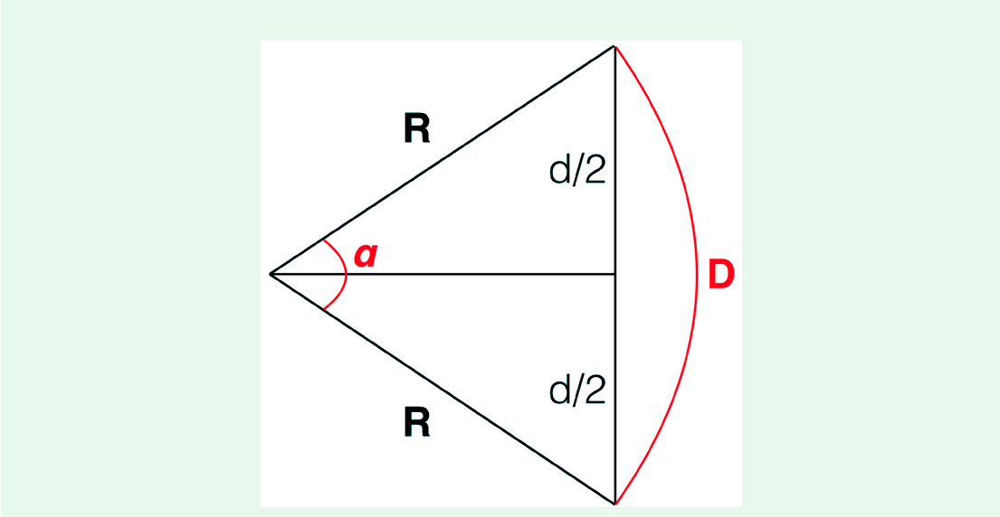
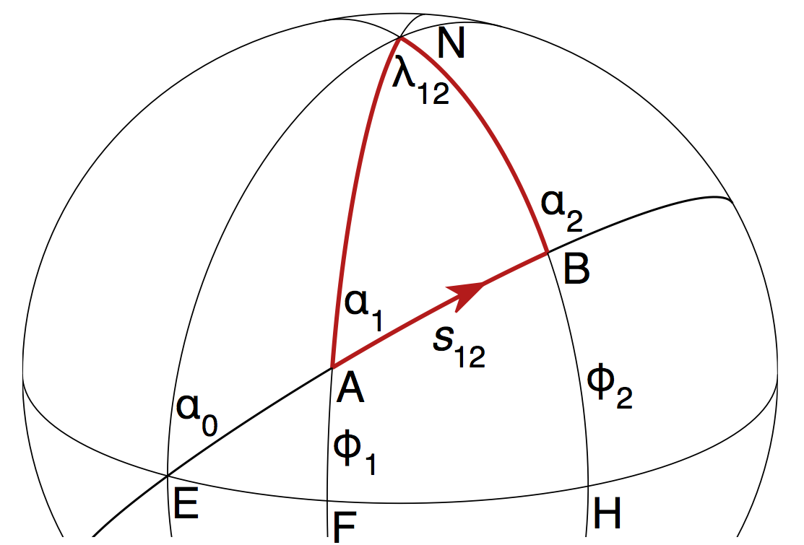
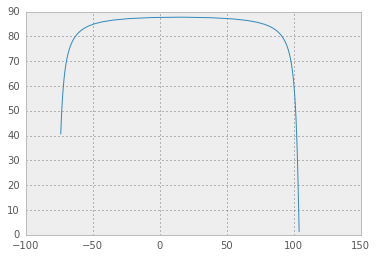

#The Geodesic Problem


##Distances and angles 

The distances between two points can be axpressesd as the shortest path between the points themselves. For a plane such distance will coincide with a straight line and is expressed by the eucidean distance (eq. 1).

$$
euclidean \ distance = \sqrt{(x_2-x_1)^2+(y_2-y_1)^2+(z_2-z_1)^2} \quad (1)
$$

On the earth surface the distances between 2 points can't be expressed as a straight line and a more relatively complex geometry has to be adopted. In the simplest case we can approssimate the shape of the earth to a sphere and perform distance calculations on the basis of a spherical trigonometry (ignoring ellipsoidal effects). 

###Distance on a sphere
[source](https://www.math.ksu.edu/~dbski/writings/haversine.pdf)

Given 2 Points $$P_1(\theta_1,\phi_1)$$ and $$P_2(\theta_2,\phi_2)$$ on the Earth’s Surface in polar coordinates, which coincide with $$P_1(x_1,y_1,z_1)$$ and $$P_2(x_2,y_2,z_2)$$ in cartesian coordinates. The distance $$d$$ on the surface of a sphere is computed in two stages:
* Compute the euclidean distance as a straight line
* Convert the measurments to spherical coordinates

The conversion from polar coordinates $$(\theta, \phi)$$ to cartesian $$(X,Y,Z)$$ is given by the relation:

$$
X = R \cdot \cos(\theta) \cdot \cos(\phi) \\
Y = R \cdot \cos(\theta) \cdot \sin(\phi) \\
Z = R \cdot sin(\theta) 
$$

and the three-dimensional euclidean distance $d$ is given by:

$$
d = \sqrt{(x_1-x_2)^2+(y_1-y_2)^2+(z_1-z_2)^2} 
$$


Converting the cartesian coordinates to spherical coordinates, the distance $d$ on a sphere is found by:

$$
d^2 = 2 - 2 \cos(\theta_1) \cdot cos(\theta_2) \cdot cos(\phi_1 - \phi_2) - 2\sin(\theta_1) \cdot sin(\theta_2)
$$


Now from figure 1 we have that:

$$
\sin{\frac{\alpha}{2}} = \frac{d}{2R}
$$

which gives:

$$
\sin(\alpha) = \frac{d}{R} \cdot \sqrt{1-(\frac{d}{2R})^2} = \frac{d}{2R^2} \cdot \sqrt{4R^2-d^2}
$$

and in therms of $$d$$ and $$R$$ the distance $$D$$ is given by:

$$
D = R \alpha = R \sin^{-1}{(\frac{d}{2R^2}\cdot \sqrt{4R^2-d^2})}
$$




<center>Figure 1</center>

### Distance on curved surface

The shortest path between two points on a curved surface is colled *geodesic* which in case of a spheroid is also colled *Great Circle*.
Considering two points: $$P_1(\lambda_1,\phi_1), P_2(\lambda_2,\phi_2)$$, The great circle distance $$d$$ between $$P_1$$ and $$P_2$$ is given by eq. 2: 

$$
d = 2 \cdot \arcsin(\sqrt{\sin{(\frac{\phi_1-\phi_2}{2})}^2 + \cos(\phi_1) \cdot \cos(\phi_2) \cdot (\sin{\frac{\lambda_1-\lambda_2}{2}})^2} \quad (2)
$$

This approach is good enough for most purposes but for more accurate results, the computation needs to be performed on an ellipsoid of revolution. 

The shortes distance between two points on the ellipse surface is also known as *Geodesics on an ellipsoid* and can be computed by the algorithms given in [*Algorithms for geodesics* Karney (2013)](http://link.springer.com/article/10.1007%2Fs00190-012-0578-z) which is implemented in the  [geographiclib](http://geographiclib.sourceforge.net/) software, internally adopted by the proj library.


---

## The direct and Inverse Geodesic Problems on a Ellipsoid of revolution


The problems in geodesy are usually reduced to two main cases: the direct problem, given a starting point and an initial heading, find the position after traveling a certain distance along the geodesic; and the inverse problem, given two points on the ellipsoid find the connecting geodesic and hence the shortest distance between them. Because the flattening of the Earth is small, the geodesic distance between two points on the Earth is well approximated by the great-circle distance using the mean Earth radius - the relative error is less than $$1\%$$. However, the course of the geodesic can differ dramatically from that of the great circle. As an extreme example, consider two points on the equator with a longitude difference of $$179^\circ 59$$; while the connecting great circle follows the equator, the shortest geodesics pass within $$180 km$$ of either pole (the flattening makes two symmetric paths passing close to the poles shorter than the route along the equator).

  It is possible to reduce the various geodesic problems into one of two types. Consider two points: $$A(\phi_{1}, \lambda_1)$$ and $$B(\phi_2, \lambda_2)$$, see Fig. 3. 
  
  The connecting geodesic (from $$A$$ to $$B$$) is $$AB$$, of length $$s_{12}$$, which has azimuths $$\alpha_1$$ and $$\alpha_2$$ at the two endpoints. 

The two geodesic problems usually considered are :
* The **direct geodesic problem** (or *first geodesic problem*) to determine:

    $$\phi_2, \lambda_{12}, \alpha_2$$ given $$\phi_1, \alpha_1, s_{12}$$


  * the **inverse geodesic problem** (or second geodesic problem) to determine:
   
  $$s_{12}, \alpha_1, \alpha_2$$ given $$\phi_1, \phi_2, \lambda_{12}$$





FIG. 2 The ellipsoidal triangle $$\triangle{NAB}$$. $$N$$ is the north pole, $$NA$$ and
$$NB$$ are *meridians*, and $$AB$$ is a *geodesic* of length $$s_{12}$$.

The longitude of $$B$$ relative to $$A$$ is $$\lambda_{12}$$; the latitudes of $$A$$ and $$B$$ are $$\phi_1$$ and
$$\phi_2$$. $$EFH$$ is the *equator* with $$E$$ also lying on the extension of the
geodesic $$AB$$; and $$\alpha_0$$, $$\alpha_1$$, and $$\alpha_2$$ are the azimuths of the geodesic
at $$E$$, $$A$$, and $$B$$.   

[source](https://en.wikipedia.org/wiki/Geodesics_on_an_ellipsoid)

---
###The inverse geodesic problem

**Example:**

Calculate the distance between two points, as well as the local heading:

* First we import the class [```Geod```](http://jswhit.github.io/pyproj/pyproj.Geod-class.html) then we define a reference ellipsoid where ```ellps='WGS84'``` selects WGS84 reference ellipsoid. ```help(Geod.__new__)``` gives a list of possible ellipsoids.


    from pyproj import Geod
    g = Geod(ellps='WGS84')

* Set two location for which we want compute the measurments, in this example $P_1$


    lat1,lon1 = (40.7143528, -74.0059731)  # New York, NY
    lat2,lon2 = (1.359, 103.989)   # Delhi, India
    az12,az21,dist = g.inv(lon1,lat1,lon2,lat2)
    az12,az21,dist


    (2.9684846301409524, -2.253438854385905, 15340419.982393192)


    # using geograhiclib:
    # Compute path from 1 to 2
    from geographiclib.geodesic import Geodesic
    g = Geodesic.WGS84.Inverse(lat1, lon1, lat2, lon2)
    g


    {'a12': 137.98724650558404,
     'azi1': 2.9684846301409524,
     'azi2': 177.7465611456141,
     'lat1': 40.7143528,
     'lat2': 1.359,
     'lon1': -74.0059731,
     'lon2': 103.989,
     's12': 15340419.982393192}


Note: 
* pyproj takes as input longitude first then latitude
* the output of geographiclib and pyproj for the backward azimuth are complementary of 180^{\circ}

###The direct geodesic problem:

**Example:**

Compute the midpoint on the path from 1 to 2 starting at 1


    h = Geodesic.WGS84.Direct(lat1, lon1, g['azi1'], g['s12']/2)
    print(h['lat2'], h['lon2']);

    70.33911423157132 97.75118772943782


### Geodetic curve

**Example:**

Compute a list of points along the $geodesic \ curve$ with a fixed distance of $100000m$


    gc = [Geodesic.WGS84.Direct(lat1, lon1, g['azi1'], i) for i in range(0,int(g['s12']),100000)]

Extract *Latitude* and *Longitude* from and add the destination point which is missed in the previous list


    lat = [i['lat2'] for i in gc]
    lat.append(lat2)
    lon = [i['lon2'] for i in gc]
    lon.append(lon2)

We can plot the resulting geodesic with:


    %matplotlib inline


    import matplotlib.pyplot as plt
    plt.plot(lon,lat,'-');





---
###Surface's area on the ellipsoid
The Geodesic class in geographiclib can be also used to compute the area on an ellipsoidal surface, see example:


    # Computing the area of a geodesic polygon
    def p(lat,lon): return {'lat': lat, 'lon': lon}
    Geodesic.WGS84.Area([p(0, 0), p(0, 90), p(90, 0)])


    {'area': 63758202715511.055, 'number': 3, 'perimeter': 30022685.630020067}


